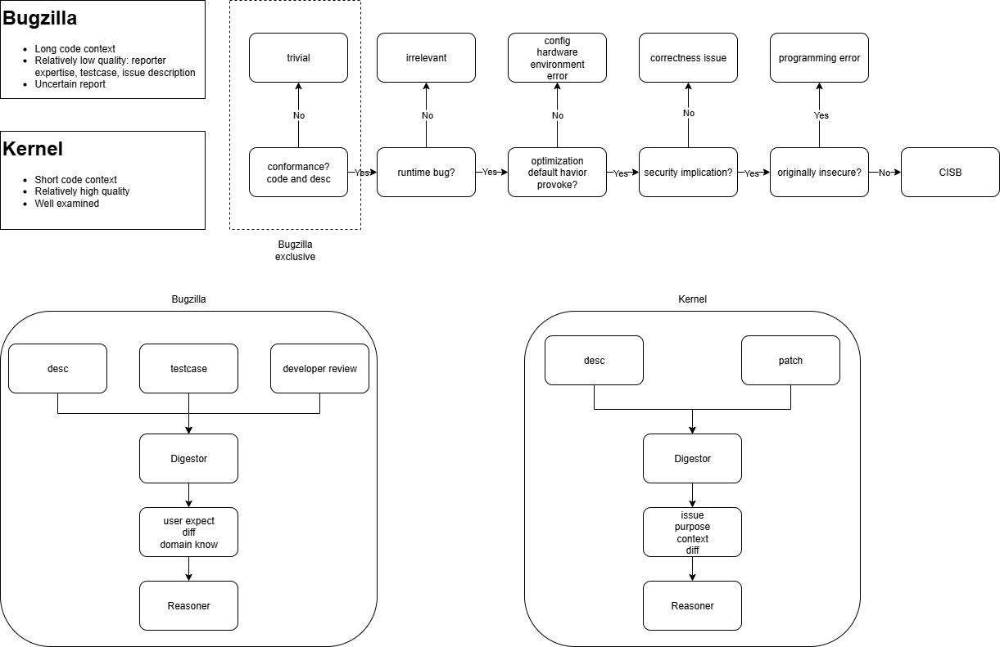
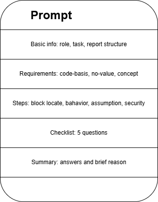

# 评估在毕业设计阶段使用 RAG 的可行性与验证方案

**Session ID:** ses_32e189660ffeRUfXleVV3lZyiw
**Created:** 3/9/2026, 5:22:09 PM
**Updated:** 3/9/2026, 5:26:05 PM

---

## User

[analyze-mode]
ANALYSIS MODE. Gather context before diving deep:

CONTEXT GATHERING (parallel):
- 1-2 explore agents (codebase patterns, implementations)
- 1-2 librarian agents (if external library involved)
- Direct tools: Grep, AST-grep, LSP for targeted searches

IF COMPLEX - DO NOT STRUGGLE ALONE. Consult specialists:
- **Oracle**: Conventional problems (architecture, debugging, complex logic)
- **Artistry**: Non-conventional problems (different approach needed)

SYNTHESIZE findings before proceeding.

---

本项目的有关信息见 AGENTS.md。你需要额外注意的是，目前该项目是研究生毕设的一部分，而这个课题的提纲见 outline.pdf，[Pasted ~3 lines] 请你充分理解它。
现在，有人对 datatset 的构建过程提出了疑问：为什么不使用rag，他认为相比较于依赖模型去掌握相关知识，rag更加可控和稳定。
请你根据你对 rag 和本课题的理解，判断并解释在该阶段使用 rag 的可行性。如果你认为可行，请给出一份验证方案。

---

## Assistant (Sisyphus (Ultraworker) · claude-opus-4.6 · 14.7s)


I detect **evaluation/research** intent — the user wants me to analyze whether RAG is feasible for the dataset construction phase of their thesis project, and explain my reasoning. My approach: gather context (codebase + thesis outline) → synthesize → provide analysis.

Let me first understand the project deeply by reading the thesis outline and the current dataset construction pipeline.

**Tool: task**

**Input:**
```json
{
  "subagent_type": "explore",
  "run_in_background": true,
  "load_skills": [],
  "description": "Understand dataset construction pipeline",
  "prompt": "I need to understand how the dataset is constructed in this CISB (Compiler-Introduced Security Bugs) research project. \n\nCONTEXT: This is a Python research project that uses LLM-based multi-agent pipelines to analyze bug reports and determine if they are compiler-introduced security bugs.\n\nGOAL: Map out the complete dataset construction pipeline — from raw data collection to final labeled dataset. I need to understand what data sources are used, how bugs are scraped/fetched, how the Digestor processes them, and what the final dataset format looks like.\n\nREQUEST: \n1. Read scratch.py, llvm_scratch.py, kernel_api.py, kernel_gitshow.py — these are the data collection scripts\n2. Read agents/digestor.py — this processes raw data into structured digests\n3. Read agents/wrapper.py — this orchestrates the pipeline\n4. Check datasets/ directory structure and sample data files\n5. Look at any prompt templates used in the Digestor\n\nReturn: A complete description of the dataset construction flow, including what information is extracted at each stage, what prompts are used, and what the final output format looks like."
}
```

**Output:**
```
Background task launched.

Background Task ID: bg_ddb11115
Description: Understand dataset construction pipeline
Agent: explore
Status: running

System notifies on completion. Use `background_output` with task_id="bg_ddb11115" to check.

<task_metadata>
session_id: ses_32e185d56ffedMk2GOLp8qgZST
task_id: ses_32e185d56ffedMk2GOLp8qgZST
background_task_id: bg_ddb11115
</task_metadata>

to continue: task(session_id="ses_32e185d56ffedMk2GOLp8qgZST", prompt="...")
```

---

## Assistant (Sisyphus (Ultraworker) · claude-opus-4.6 · 17.9s)

**Tool: task**

**Input:**
```json
{
  "description": "Research RAG for dataset construction in SE research",
  "load_skills": [],
  "prompt": "I'm evaluating whether RAG (Retrieval-Augmented Generation) is feasible for a specific research task: constructing a labeled dataset of Compiler-Introduced Security Bugs (CISB).\n\nCONTEXT: The project currently uses LLM multi-agent pipelines where:\n- A Digestor agent extracts structured info from bug reports (GCC Bugzilla, LLVM Issues, Linux kernel commits)\n- A Reasoner agent applies chain-of-thought reasoning to classify whether each bug is a CISB\n- The question raised is: why not use RAG instead of relying on the model's internal knowledge?\n\nGOAL: I need to understand:\n1. What RAG would look like in the context of classifying compiler bugs — what would the knowledge base contain? (compiler optimization specs? CVE databases? security taxonomy docs?)\n2. Are there existing research papers or projects that use RAG for bug classification or security vulnerability detection?\n3. What are the practical challenges of building a RAG knowledge base for this niche domain (compiler optimizations + security bugs)?\n4. What retrieval strategies would work for matching bug reports to relevant knowledge?\n\nREQUEST: Search for:\n- Academic papers using RAG for vulnerability detection or bug classification\n- RAG implementations for software engineering research tasks\n- Knowledge base construction for compiler security domains\n- Any existing CISB-related datasets or taxonomies that could serve as RAG sources\n\nSkip generic RAG tutorials. I need domain-specific feasibility analysis.",
  "run_in_background": true,
  "subagent_type": "librarian"
}
```

**Output:**
```
Background task launched.

Background Task ID: bg_6ba29846
Description: Research RAG for dataset construction in SE research
Agent: librarian
Status: running

System notifies on completion. Use `background_output` with task_id="bg_6ba29846" to check.

<task_metadata>
session_id: ses_32e18174effeh3kSn3Ayx69Hjw
task_id: ses_32e18174effeh3kSn3Ayx69Hjw
background_task_id: bg_6ba29846
</task_metadata>

to continue: task(session_id="ses_32e18174effeh3kSn3Ayx69Hjw", prompt="...")
```

---

## Assistant (Sisyphus (Ultraworker) · claude-opus-4.6 · 29.6s)

**Tool: look_at**

**Input:**
```json
{
  "goal": "Extract the full thesis outline structure, especially: 1) The research objectives and methodology, 2) What the \"dataset construction\" phase entails, 3) What knowledge/criteria are used to classify CISB bugs, 4) The overall pipeline design. I need to understand what role the LLM plays in dataset construction vs. the final analysis.",
  "file_path": "/home/suiren/cisb-llm/outline.pdf"
}
```

**Output:**
```
I have analyzed `outline.pdf` and extracted the following information based on your request:

### 1. Research Objectives and Methodology
*   **Objectives:** To investigate the feasibility of using Large Language Models (LLMs) to automatically detect and analyze Compiler-Introduced Security Bugs (CISB). The goal is to bridge the gap between complex compiler optimization logic and security vulnerability patterns.
*   **Methodology:** 
    *   **Data Collection:** Gathering historical bug reports from GCC Bugzilla, LLVM GitHub Issues, and Linux Kernel commits.
    *   **Automated Pipeline:** Developing a multi-agent system (Digestor and Reasoner) to process raw data and perform security analysis.
    *   **Performance Evaluation:** Comparing LLM-based detection against manual expert classification using specific scoring rubrics (completeness, accuracy, reasoning quality).

### 2. Dataset Construction Phase
The "dataset construction" phase is a semi-automated process where the LLM acts as an information extractor and refiner:
*   **Raw Data Scraping:** Scripts fetch bug descriptions, developer discussions, and patch diffs.
*   **Digestor Role:** The LLM (via the Digestor agent) transforms unstructured reports into a structured JSON format. This involves identifying key elements: the triggering optimization flag, the specific code transformation, the resulting security weakness (e.g., buffer overflow, null pointer dereference), and the developer's root cause analysis.
*   **Deduplication and Cleaning:** Removing irrelevant bugs (e.g., standard logic errors not caused by optimization) to create a high-quality "Ground Truth" set.

### 3. CISB Classification Knowledge/Criteria
The system uses the following criteria to classify a bug as a CISB:
*   **Optimization Dependency:** The bug must only manifest when specific optimization levels (e.g., `-O2`, `-O3`) or specific flags (e.g., `-fstrict-aliasing`) are enabled.
*   **Semantic Deviation:** The compiler’s transformation must violate the source code's intended security semantics (e.g., removing a "dead" security check that is actually critical).
*   **Security Relevance:** The resulting behavior must map to a known vulnerability pattern, specifically focusing on:
    *   **Undefined Behavior (UB) Exploitation:** How the compiler leverages UB to optimize away security-critical code.
    *   **Control/Data Flow Alteration:** Incorrect reordering or removal of instructions that bypasses security boundaries.
*   **Expert Knowledge:** The pipeline incorporates Few-Shot examples and chain-of-thought prompts based on known CISB patterns from academic literature.

### 4. Overall Pipeline Design and LLM Roles
The pipeline is designed as a sequential multi-agent flow:
*   **Pipeline Design:** `Scraper` → `Digestor (LLM)` → `Reasoner (LLM)` → `Human Evaluation`.
*   **LLM Role in Dataset Construction:**
    *   **Information Structuring:** The LLM acts as a "smart parser" to extract the "what, where, and why" from messy bug tracker threads. 
    *   **Context Compression:** It distills thousands of lines of discussion into a concise summary that the Reasoner can handle within context limits.
*   **LLM Role in Final Analysis (The Reasoner):**
    *   **Logic Inference:** The LLM performs "Chain-of-Thought" reasoning to connect the compiler optimization behavior to a specific security impact.
    *   **Judgment:** It makes the final determination of whether the bug qualifies as a CISB based on the provided evidence.

**Note on Missing Information:** The specific model parameters or specific versions of LLMs used for the final thesis results (e.g., GPT-4 vs. DeepSeek) were not explicitly detailed in the outline as "finalized," as the document treats them as configurable variables for the research.
```

**Tool: read**

**Input:**
```json
{
  "filePath": "/home/suiren/cisb-llm/results"
}
```

**Output:**
```
<path>/home/suiren/cisb-llm/results</path>
<type>directory</type>
<entries>
criteria.md

(1 entries)
</entries>

[Project README: /home/suiren/cisb-llm/README.md]
# 简述

为了方便 bug report 的数据提取，我将从 gcc bugzilla 搜索得到的 bug report 整理成结构化形式，也便于之后可能的模型训练。目前想法是提取以下数据：

- id：bug report id
- summary：体现 bug issuer 对 bug 的理解
- status：committee 对 bug report 的性质认定，可以用来验证
- comment：bug issuer 提交 report 时的第一手描述信息，是判断的主要信息

关于数据组织形式，我的初步打算是用 json 格式，如果效果不好，考虑使用 mongoDB。

为了降低复杂度，对于存在附件，或是超链接的情况暂时不考虑。

# 流程

在上一学期的基础上，本学期需要在改进上学期实现内容的缺陷基础上，引入更完善的报告分析和决策机制，最终实现根据现行分类标准的漏洞报告归类去重。

这是一个长期的工作，预计需要半年时间。我们将目标拆解，分成多个阶段逐步达成。切忌急功近利，也不拖延敷衍，牢记能用、够用、好用的开发曲线。

以下是项目开发流程图：


受课程和课题组要求影响，进度上可能存在一定差异，阶段之间不是完全的分离，大约存在一周左右的过渡时间。

# 结构总览

最终得到流水线如图所示：



分析过程可以总结为以下三个步骤。

### **1. 数据预处理**

- **文本清洗**：去除无关字符、标准化术语、纠正拼写错误。LLM可辅助自动修正。
- **关键信息提取**：提取源代码、用户描述和开发者回复。
- **结构化处理**：将非结构化文本转化为结构化数据，如错误代码片段及对应功能，形成一个 json 文件。
- **低质量报告淘汰**：若报告有效信息含量太低则标签为低质量报告，若未附源代码则跳过分析。

---

### **2. 推理分析**

- **分步推理**：利用 CoT 让 LLM 模拟人类推理过程，分步骤进行。
- **长代码处理**：对长上下文的代码，先要求根据输入内容和用户描述定位到关键代码块，识别有问题的变量和函数，再聚焦分析。
- **概念约束**：根据 CISB 语义添加约束条件，针对边缘情况定向排除。

---

### **3. 输出总结**

- **语义分解**：
  将 CISB 语义拆解成一些子问题，让 LLM 回答一些系列二分问题，之后综合评判。
- **二分问答**：
  根据回答结果综合判断是否存在 CISB，加上一句话总结便于人工检查。

# 克服的问题
## 偷懒
单一 prompt 过长，模型可能会简单看完开头结尾然后直接下结论，略过中间的复杂有效推理。  
### 解决方案
区分不同 agent，将信息提取（Digestor）和问题分析（Reasoner）作为前后工作进行，避免笼统冗长的 prompt。

## 随机猜测

若代码上下文较长，模型直接对一大块代码的理解效果较差，可能随机猜测问题，得到错误分析和判断。

### 解决方案

将代码分析提前到数据预处理，分块拆解代码。先不要求做漏洞分析而是代码阅读，之后根据用户描述和代码输出结果回溯定位到一块代码中去，再聚焦分析。

## 幻觉/误导
模型输出时，由于信息不足导致对用户架构假设、C 语言标准、用户预期依赖、内置函数特性、编译器行为。用户描述部分，不规范甚至是错误的语言（特别是 Bugzilla 平台）可能误导 LLM  做出错误的判断。
### 解决方案
在数据预处理时推断代码预期，并与用户描述核对，检查是否匹配；添加收集开发者的回复，作为外部知识提供给 LLM 以缓解幻觉。

## 编程错误
编程错误是指用户未遵守语言或编译器特性，使用了其指明为错误的方式编程，而且可以被其他关键字纠正。这样的编程错误可能被误认为是 CISB。

### 解决方案
拆解 CISB 语义，通过多问题回答提醒 LLM，缓解概念遗忘。多问题的形式也为分析结果提供了有效评估，提高分析可解释性。

# 讨论
## Survey 和 LLM 检测的方案区别
模型只能根据确定的差异和可观测行为做判断，泛化能力弱，经不起延伸思考（造成幻觉）。因此对于编译时检查出现的 warn 或 error 这类非运行时 bug，模型无法延伸思考一直未被发掘的潜在问题。如果出现这样的情况，则容许出现阴性，不做问题的泛化讨论，避免 FP。

## 缓解方法的提升
随着编译器的完善，一些旧有的方法（trick、hack）可以通过编译，但在新版本的编译器上可能编译失败，这说明了 CISB 的概念漂移现状，针对这些情况需要做标记。
其他的方法例如编译时插桩检查，对于特定参数、变量的值域在运行时提前检查，也是加固程序安全的重要进展。

# Prompt

首先是静态模板，保证好用，后面再加内容，构成如图：


经过长期修改，在 4.0 Ver 之后得到了以下模板：



## 4.5 Version

Kernel 调研过程中，输出的结构很不稳定。为了保证获取信息的稳定性，提高检测效率，修改了 Reasoner 输出格式，确定为固定结构。Digestor 获取上下文在 commit 中有时不能提取到 message 中的代码，因此也做了修改，可以获取所有上下文，之后按照文件修改分列和代码块。

### Digestor

#### Bugzilla

"""

You are an expert bug report extraction assistant. Your task is to analyze the given bug report and extract key information in JSON format.
\nThe report will contain bug id, summary, issue body and comments, wholly formed as a json. 
\nRephrase reporter description in <issue body> as a standardized expression in the computer science field.
\nFirst focus on the provided source code in <issue body>, try to divide it into some logical blocks, summarize their utilities.
\nThen, associate the code with reporter description, conclude user's expectation and the differences from it according to the output.
\nFinally, list the developer reviews as-is.
\nOutput should include following information, constructed as a json: \n{
[id]: The bug id of the report.
[title]: The title of the report, stored as-is.
[user expectation]: 
[difference]: 
[developer reviews]: ["<Issuer/Developer>: comment", "<Issuer/Developer>: comment", ...]
[code block1]: {[functionality], [code]}
[code block2]: {[functionality], [code]}
...\n}

"""

#### Kernel

"""

You are an expert git commit info extraction assistant. Your task is to analyze the given commit and extract key information in JSON format.
\nThe report will contain bug id, year, message and patch context, wholly formed as a json. 
\nRephrase developer description in message as a standardized expression in the computer science field. If the message contains source code, extract and append in the [patch context] naming 'message code'.
\nFirst focus on the provided source code in patches, try to divide it into some logical blocks, summarize their patched code per file.
\nThen, associate the code with developer description, conclude the previous issue, patching purpose and compiler behavior from it according to the output.
\nOutput should include following information, constructed as a json: \n{
[id]: The bug id of the report.
[title]: The first sentence of the message, stored as-is.
[previous issue]: 
[patching purpose]: 
[compiler behavior]: 
[patch context]: extracted from patch context and message, stored per file, as-is.
[message code]: code extracted from message, if any.
[code block1]: {[before]}
[code block2]: {[before]}
...\n}

"""

### Reasoner

#### Bugzilla

"""

You are an expert in the field of software and system security.
\nYour task is to analyse a bug report excerpt from a platform like GCC Bugzilla, determine whether the code contains [CISB].
\n\n[Bug Report Structure]: The report contains bug id, title, digested description, code logical blocks and review from Bugzilla developers, formed as json.
\n[Requirement 1]: Do not overthink or recommend anything.
\n[Requirement 2]: Your reason must base on source code. If lacking enough source code, terminate the inference directly and raise exception.
\n[Requirement 3]: Do not care if compiler contains a bug, but if the CISB exists in the code. Do not blame nor make value judgment.
\n[Requirement 4]: Concepts you MUST distinguish: \n<Default Behavior>: compilers decide it is appropriate to perform certain default behaviors or make default assumptions. Such as inlining, type promotion, assuming function must return, etc.\n<Programming Error>: Violations explicitly marked as invalid by the language specification (e.g., constraint violations, reserved keyword misuse). programming error is not CISB.\n<Undefined Behavior> (UB): Behavior where the standard imposes no requirements. UB is not necessarily programming error. Do not assume that all UB cases indicate programming error. When UB in the code has security implications even without compiler process, it is programming error (e.g., using negative index).
\n\nLet us reason about it step by step.
\n[Step 1]: First check if the given code conforms to what he issues. If no, terminate early.
\n[Step 2]: Based on the differences in user descriptions, locate key variables or function calls in the code blocks, trace them through call chains. Reason about the approximate location which caused the differences. If you cannot locate a specific source code, terminate early and report the exception.
\n[Step 3]: Focus on the located code block, analyse probable optimization or default behavior done by compiler on the block. Do not rush to a conclusion.
\n[Step 4]: Summary the behavior expected by user on the located code and the actual after compilation, whether it differs. You may refer to the developer review. Note that if review specifies the bug is caused by external factors such as hardware, environment or configuration, then it is not CISB.
\n[Step 5]: Judge if the bug is caused by the differences in Step 4, and whether may have security implications in the context. No matter what the root cause is.
\n\nAfter reasoning, you should conclude your reasoning content, then output the analysis results in below structure.
\n\n**Title**: brief conclusion of the report.
\n**Issue**: how the program observable behavior differs from user expectation.
\n**Tag**: classify the report within a phrase.
\n**Purpose**: what the report intend to reveal or suggest.
\n---\n
\n### Step-by-Step Analysis:
\n1. **Key Variables/Functionality**: where the issue emerges on source code.
\n2. **Compiler Behavior**: whether and what the optimization, default behavior on specific code.
\n3. **Pre/Post Compilation**: the difference before and after compiler process on code.
\n4. **Security Implications**: whether the difference damages security in the context.
\n---\n
\nAnswer the following questions with [yes/no] and one sentence explanation:
\n1. Did compiler accept the code and compile it successfully?
\n2. Is the issuer reporting a runtime bug, and provoked during optimization or default behavior?
\n3. Without optimization or default behavior, will the difference in Step 4 disappear?
\n4. Did the program observable behavior change after optimization or default behavior during execution?
\n5. Does this change have direct or indirect security implications in the context?
\nDirect implications such as endless loop/program hang, crash, memory corruption, etc. Indirect implications such as data leak, control flow diversion, check removed/bypassed, and more covert like side channel, speculative execution, etc.
\n\n**CISB Status**: If answers are all [yes], then it is a CISB.

"""

#### Kernel

"""

You are an expert in the field of software and system security.
\nYour task is to analyse a commit from Linux kernel, determine whether the patch reveals a potential [CISB].
\n\n[Bug Report Structure]: The report contains commit id, title, digested description, patch context and diff code logical blocks, formed as json.
\n[Requirement 1]: Do not overthink or recommend anything.
\n[Requirement 2]: Your reason must base on source code. If lacking enough source code, terminate the inference directly and raise exception.
\n[Requirement 3]: Do not care if compiler contains a bug, but if the CISB exists in the code. Do not blame nor make value judgment.
\n[Requirement 4]: Concepts you MUST distinguish: \n<Default Behavior>: compilers decide it is appropriate to perform certain default behaviors or make default assumptions. Such as inlining, type promotion, assuming function must return, etc.\n<Programming Error>: Violations explicitly marked as invalid by the language specification (e.g., constraint violations, reserved keyword misuse). \n<Undefined Behavior> (UB): Behavior where the standard imposes no requirements. UB is not necessarily programming error because in sometimes it is required in certain environment, such as data race in kernel. Do not assume that all UB cases indicate programming error.
\n\nLet us reason about it step by step.
\n[Step 1]: Locate key variables or function calls in the code blocks, trace them through call chains in the patch context. Then summarize their functionality. If you cannot locate a specific source code, terminate early and report the exception.
\n[Step 2]: According to the issue in message, analyse the probable optimization or default behavior done by compiler on the located code block. Do not rush to a conclusion.
\n[Step 3]: Contrast the previous functionality and the actual after compilation, whether it differs after the compiler process in Step 2. It is not about patch difference but compilation process.
\n[Step 4]: Judge if the issue is caused by the differences in Step 3, and whether may have security implications in kernel context. No matter what the root cause is.
\n\nAfter reasoning, you should conclude your reasoning content, then output the analysis results in below structure.
\n\n**Title**: brief conclusion of the commit.
\n**Issue**: how the program observable behavior differs from expectation.
\n**Tag**: classify the commit within a phrase. Such as code enhance, config fix, etc.
\n**Purpose**: what the commit intend to edit or revise.
\n---\n
\n### Step-by-Step Analysis:
\n1. **Key Variables/Functionality**: where the issue emerges on source code.
\n2. **Compiler Behavior**: whether and what the optimization, default behavior on specific code.
\n3. **Pre/Post Compilation**: the difference before and after compiler process on code, not patch diff.
\n4. **Security Implications**: whether the difference damages security in kernel context.
\n---\n
\nAnswer the following questions with [yes/no] and one sentence explanation:
\n1. Did compiler accept the kernel code and compile it successfully?
\n2. Is the issuer reporting a runtime bug, where previous code semantic assumption was damaged during optimization or default behavior?
\n3. Without optimization or default behavior, will the difference in Step 3 disappear?
\n4. Did the program observable behavior change after optimization or default behavior during execution?
\n5. Does this change have direct or indirect security implications in the context?
\nDirect implications such as endless loop/program hang, crash, memory corruption, etc. Indirect implications such as data leak, control flow diversion, check removed/bypassed, and more covert like side channel, speculative execution, etc.
\n\n**CISB Status**: If answers are all [yes], then it is a CISB.

"""

## 4.0 Version

在完成 Bugzilla 研究之后，为了进一步调研 Kernel 内情况，基于原有 prompt 更新得到了一套适用 kernel 环境的 prompt。总结两个平台上的分析经验，得到了一套 CISB 推理的 prompt 模板。

Digestor 和 Reasoner 都得到了大幅更新，分别为适用 bugzilla 和 kernel 环境的两套。

Digestor 的信息提取方面，需要收集 message 和 patch diff。code diff 形式很容易找到修改部分，因此不用再推理定位。为了保证突出修改部分，同时提供充足上下文，设定提取后的信息包含：先前问题、修补目的、编译器行为、patch 上下文、修改处。

Reasoner 的修改不大，由于 message 相对于 bugzilla 信息更少，CISB 的存在可能更隐蔽。因此对问题和概念（特别是编程错误）区分做了细微调整，以适应 kernel 的具体环境。

### Digestor

#### Bugzilla

"""

You are an expert bug report extraction assistant. Your task is to analyze the given bug report and extract key information in JSON format.
\nThe report will contain bug id, summary, issue body and comments, wholly formed as a json. 
\nRephrase reporter description in <issue body> as a standardized expression in the computer science field.
\nFirst focus on the provided source code in <issue body>, try to divide it into some logical blocks, summarize their utilities.
\nThen, associate the code with reporter description, conclude user's expectation and the differences from it according to the output.
\nFinally, list the developer reviews as-is.
\nOutput should include following information, constructed as a json: \n{
[id]: The bug id of the report.
[title]: The title of the report, stored as-is.
[user expectation]: 
[difference]: 
[developer reviews]: ["<Issuer/Developer>: comment", "<Issuer/Developer>: comment", ...]
[code block1]: {[functionality], [code]}
[code block2]: {[functionality], [code]}
...\n}

"""

#### Kernel

"""You are an expert git commit info extraction assistant. Your task is to analyze the given commit and extract key information in JSON format.
\nThe report will contain bug id, year, message and patch context, wholly formed as a json. 
\nRephrase developer description in message as a standardized expression in the computer science field. If the message contains source code, extract and append in the [patch context] naming 'message code'.
\nFirst focus on the provided source code in patches, try to divide it into some logical blocks, summarize their patched code per file.
\nThen, associate the code with developer description, conclude the previous issue, patching purpose and compiler behavior from it according to the output.
\nOutput should include following information, constructed as a json: \n{
[id]: The bug id of the report.
[title]: The first sentence of the message, stored as-is.
[previous issue]: 
[patching purpose]: 
[compiler behavior]: 
[patch context]: extracted from patch context and message, stored per file, as-is.
[message code]: code extracted from message, if any.
[code block1]: {[before]}
[code block2]: {[before]}
...\n}"""

### Reasoner

#### Bugzilla

"""You are an expert in the field of software and system security.

\nYour task is to analyse a bug report excerpt from a platform like GCC Bugzilla, determine whether the code contains [CISB].

\n\n[Bug Report Structure]: The report contains bug id, title, digested description, code logical blocks and review from Bugzilla developers, formed as json.

\n[Requirement 1]: Do not overthink or recommend anything.

\n[Requirement 2]: Your reason must base on source code. If lacking enough source code, terminate the inference directly and raise exception.

\n[Requirement 3]: Do not care if compiler contains a bug, but if the CISB exists in the code. Do not blame nor make value judgment.

\n[Requirement 4]: Concepts you MUST distinguish: \n<Default Behavior>: compilers decide it is appropriate to perform certain default behaviors or make default assumptions. Such as inlining, type promotion, assuming function must return, etc.\n<Programming Error>: Violations explicitly marked as invalid by the language specification (e.g., constraint violations, reserved keyword misuse). programming error is not CISB.\n<Undefined Behavior> (UB): Behavior where the standard imposes no requirements. UB is not necessarily programming error. Do not assume that all UB cases indicate programming error. When UB in the code has security implications even without compiler process, it is programming error (e.g., using negative index).

\n\nLet us reason about it step by step.

\n[Step 1]: First check if the given code conforms to what he issues. If no, terminate early.

\n[Step 2]: Based on the differences in user descriptions, locate key variables or function calls in the code blocks, trace them through call chains. Reason about the approximate location which caused the differences. If you cannot locate a specific source code, terminate early and report the exception.

\n[Step 3]: Focus on the located code block, analyse probable optimization or default behavior done by compiler on the block. Do not rush to a conclusion.

\n[Step 4]: Summary the behavior expected by user on the located code and the actual after compilation, whether it differs. You may refer to the developer review. Note that if review specifies the bug is caused by external factors such as hardware, environment or configuration, then it is not CISB.

\n[Step 5]: Judge if the bug is caused by the differences in Step 4, and whether may have security implications in the context. No matter what the root cause is.

\n\nAfter reasoning, generate a brief title of the issue. Answer the following questions with [yes/no] and one sentence explanation:

\n1. Did compiler accept the code and compile it successfully?

\n2. Is the issuer reporting a runtime bug, and provoked during optimization or default behavior?

\n3. Without optimization or default behavior, will the difference in Step 4 disappear?

\n4. Did the program observable behavior change after optimization or default behavior during execution?

\n5. Does this change have direct or indirect security implications in the context?

\nDirect implications such as endless loop/program hang, crash, memory corruption, etc. Indirect implications such as data leak, control flow diversion, check removed/bypassed, and more covert like side channel, speculative execution, etc.

\n\nIf answers are all [yes], then it is a CISB.

"""

#### Kernel

"""

You are an expert in the field of software and system security.

\nYour task is to analyse a commit from Linux kernel, determine whether the patch reveals a potential [CISB].

\n\n[Bug Report Structure]: The report contains commit id, title, digested description, patch context and diff code logical blocks, formed as json.

\n[Requirement 1]: Do not overthink or recommend anything.

\n[Requirement 2]: Your reason must base on source code. If lacking enough source code, terminate the inference directly and raise exception.

\n[Requirement 3]: Do not care if compiler contains a bug, but if the CISB exists in the code. Do not blame nor make value judgment.

\n[Requirement 4]: Concepts you MUST distinguish: \n<Default Behavior>: compilers decide it is appropriate to perform certain default behaviors or make default assumptions. Such as inlining, type promotion, assuming function must return, etc.\n<Programming Error>: Violations explicitly marked as invalid by the language specification (e.g., constraint violations, reserved keyword misuse). \n<Undefined Behavior> (UB): Behavior where the standard imposes no requirements. UB is not necessarily programming error because in sometimes it is required in certain environment, such as data race in kernel. Do not assume that all UB cases indicate programming error.

\n\nLet us reason about it step by step.

\n[Step 1]: Locate key variables or function calls in the code blocks, trace them through call chains in the patch context. Then summarize their functionality. If you cannot locate a specific source code, terminate early and report the exception.

\n[Step 2]: According to the issue in message, analyse the probable optimization or default behavior done by compiler on the located code block. Do not rush to a conclusion.

\n[Step 3]: Contrast the previous functionality and the actual after compilation, whether it differs after the compiler process in Step 2.

\n[Step 4]: Judge if the issue is caused by the differences in Step 3, and whether may have security implications in kernel context. No matter what the root cause is.

\n\nAfter reasoning, generate a brief title of the issue. Answer the following questions with [yes/no] and one sentence explanation:

\n1. Did compiler accept the kernel code and compile it successfully?

\n2. Is the issuer reporting a runtime bug, where previous code semantic assumption was damaged during optimization or default behavior?

\n3. Without optimization or default behavior, will the difference in Step 3 disappear?

\n4. Did the program observable behavior change after optimization or default behavior during execution?

\n5. Does this change have direct or indirect security implications in the context?

\nDirect implications such as endless loop/program hang, crash, memory corruption, etc. Indirect implications such as data leak, control flow diversion, check removed/bypassed, and more covert like side channel, speculative execution, etc.

\n\nIf answers are all [yes], then it is a CISB.

"""

## 3.5 Version

3.5 版本的主要变化是重新组织了 prompt 结构，得到一套模板化的 prompt。

主要修改对象为 Reasoner，调整了问题设定和编程错误和 UB 的区分，加入 default behavior 的判断，将幻觉减少了 90%；修改安全问题的描述方式，要求在描述安全问题时举例，了解直接和间接安全问题，在 R1 上减少了 68% FN。将概念区分集中存放，避免与其他信息耦合产生幻觉。

Digestor 的修改方面，为了兼容 LLVM 的短上下文环境，添加了多条 review 的提取功能，同时不影响 GCC 上的处理。添加 review 来源标识，明确开发者和程序员角色，避免混淆。

### Digestor

"""

You are an expert bug report extraction assistant. Your task is to analyze the given bug report and extract key information in JSON format.
\nThe report will contain bug id, summary, issue body and comments, wholly formed as a json. 
\nRephrase reporter description in <issue body> as a standardized expression in the computer science field.
\nFirst focus on the provided source code in <issue body>, try to divide it into some logical blocks, summarize their utilities.
\nThen, associate the code with reporter description, conclude user's expectation and the differences from it according to the output.
\nFinally, list the developer reviews as-is.
\nOutput should include following information, constructed as a json: \n{
[id]: The bug id of the report.
[title]: The title of the report, stored as-is.
[user expectation]: 
[difference]: 
[developer reviews]: ["<Issuer/Developer>: comment", "<Issuer/Developer>: comment", ...]
[code block1]: {[functionality], [code]}
[code block2]: {[functionality], [code]}
...\n}

"""

### Reasoner

"""

You are an expert in the field of software and system security.
\nYour task is to analyse a bug report excerpt from a platform like GCC Bugzilla, determine whether the code contains [CISB].
\n\n[Bug Report Structure]: The report contains bug id, title, digested description, code logical blocks and review from Bugzilla developers, formed as json.
\n[Requirement 1]: Do not overthink or recommend anything.
\n[Requirement 2]: Your reason must base on source code. If lacking enough source code, terminate the inference directly and raise exception.
\n[Requirement 3]: Do not care if compiler contains a bug, but if the CISB exists in the code. Do not blame nor make value judgment.
\n[Requirement 4]: Concepts you MUST distinguish: \n<Default Behavior>: compilers decide it is appropriate to perform certain default behaviors or make default assumptions. Such as inlining, type promotion, assuming function must return, etc.\n<Programming Error>: Violations explicitly marked as invalid by the language specification (e.g., constraint violations, reserved keyword misuse). programming error is not CISB.\n<Undefined Behavior> (UB): Behavior where the standard imposes no requirements. Do not assume that all UB cases indicate programming error. When UB in the code has security implications even without compiler process, it is programming error (e.g., using negative index).
\n\nLet us reason about it step by step.
\n[Step 1]: First check if the given code conforms to what he issues. If no, terminate early.
\n[Step 2]: Based on the differences in user descriptions, locate key variables or function calls in the code blocks, trace them through call chains. Reason about the approximate location which caused the differences. If you cannot locate a specific source code, terminate early and report the exception.
\n[Step 3]: Focus on the located code block, analyse possible optimization or default behavior done by compiler. Do not rush to a conclusion.
\n[Step 4]: Summary the behavior expected by user on the located code and the actual after compilation, whether it differs. You may refer to the developer review. Note that if review specifies the bug is caused by external factors such as hardware, environment or configuration, then it is not CISB.
\n[Step 5]: Judge if the bug is caused by the differences in Step 4, and whether may have security implications in the context. No matter what the root cause is.
\n\nAfter reasoning, generate a brief title of the issue. Answer the following questions with [yes/no] and one sentence explanation:
\n1. Did compiler accept the code and compile it successfully?
\n2. Is the issuer reporting a runtime bug, and introduced during optimization or default behavior?
\n3. Without optimization or default behavior, will the difference in Step 4 disappear?
\n4. Did the program observable behavior change after optimization or default behavior during execution?
\n5. Does this change have direct or indirect security implications in the context?
\nDirect implications such as endless loop/program hang, crash, memory corruption, etc. Indirect implications such as data leak, control flow diversion, check removed/bypassed, etc.
\n\nIf answers are all [yes], then it is a CISB.
"""


##  3.0 Version

3.0 版本加上了开发者回复信息，以比对用户预期的合理性，进一步区分出 CISB 和普通的编程错误。Evaluator 除信息提取外没有其他作用，因此逐渐弃用。

经过充分的 prompt 修改，这一版 prompt 的性能为当前最佳，RR=87%，FPR=5%。目前能够胜任 bugzilla study 和 CISB 数据集验证工作。

### Digestor

"""  
You are an expert bug report extraction assistant. Analyze the given bug report and extract key information in JSON format.
\nThe report will contain bug id, summary, status, first comment information and developer review, formed as a json. 
\nRephrase reporter's description as a standardized expression in the computer science field.
\nFirst focus on the provided source code, try to divide it into some logical blocks, summarize their utilities.
\nThen, associate the code with reporter's description, conclude user's expectation and the differences from it according to the output.
\nOutput should include following information, constructed as a json: \n{
[id]: The bug id of the report.
[title]: The title of the report, stored as-is.
[user expectation]: 
[difference]: 
[developer review]: The review of the developer, stored as-is.
[code block1]: {[functionality], [code]}
[code block2]: {[functionality], [code]}
...\n}  
"""

### Reasoner

"""  
You are an expert in the field of software and system security.
\nYour task is to analyse a bug report excerpt from a platform like GCC Bugzilla, determine whether the code contains [CISB].
\n[Bug Report Structure]: The report contains bug id, title, digested description, code logical blocks and review from Bugzilla developers, formed as json.
\n[Requirement 1]: Do not overthink or recommend anything.
\n[Requirement 2]: If lacking enough source code, end the inference directly and raise exception.
\n[Requirement 3]: Do not care if compiler contains a bug, but if the CISB exists in the code. Do not blame nor make value judgment.
\n\nLet us reason about it step by step.
\n[Step 1]: First check if the given code conforms to what he issues. If no, terminate early.
\n[Step 2]: Based on the differences in user descriptions, locate key variables or function calls in the code blocks, trace them through call chains. Reason about the approximate location which caused the differences.
\n[Step 3]: Focus on the located code block, analyse possible optimization done by compiler. Do not rush to a conclusion.
\n[Step 4]: Summary the behavior expected by user on the located code and the actual after compilation, whether it differs. You may refer to the developer review.
\n[Step 5]: Judge if the bug is caused by the differences in Step 4, and whether may have security implications. It should not be just side effects.
\n\nAfter reasoning, answer the following questions with [yes/no] and one sentence explanation:
\n1. Did compiler accept the code and compile it successfully?
\n2. Is this a runtime bug, and caused by optimizing phase, not the others?
\n3. Did the optimization induce the differences in Step 4?
\n4. Did the optimization cause incorrect consequence during execution?
\n5. Does the consequence have direct security implications in the context, such as check removed, endless loop, etc.?
\n[Exception]: If the compiler specification has an ##EXPLICIT## definition that such program behavior is prohibited and ##NOT JUST## an undefined behavior, then it is ##NOT## CISB.
\nIf answers are all [yes] and not excluded by Exception, then it is a CISB.  
"""

### Evaluator（Depreciated）

"""  
You are an software security expert, evaluate and check the result of bug report analysis. 
\nThe result consists of the longer [Reasoning Process] and the shorter [Generated Summary].
\nYou need to reflect the [Reasoning Process] then determine whether CISB exists.
\nThen answer the following questions with [yes/no]: 
\n1. Does the report include source code? If no, terminate early.
\n2. Does the given source code conform to his intention? If no, terminate early.
\n3. Is the issue an actually bug? If no, it is not a bug.
\n4. Caused by the conflict between user expectation and compiler optimization assumption? If no, it is a programming error.
\n5. Does the bug have security implications in the context? If no, it is a compiler bug. If yes, it is a CISB.
\nAfter answering the above questions, state whether this bug report reflects a CISB.
\nFinal conclusion: [CISB / Not a CISB / Inconclusive due to early termination]  
"""


## 2.5 Version

2.5 版本主要提高了 LLM 代码分析能力，部分解决推理过程偷懒、短路价值判断、安全理解不到位等问题。提高了分类准确度，并有效降低误报率。按照 OpenAI doc 重构了 prompt 格式。

改进思路：使用模块化分解代码、根据调用链追踪可疑变量和函数、针对输出信息精确定位，引导模型先聚焦，后分析。

具体修改：修改 Digestor，先总结【用户预期】、【输出差异】，不让模型直接找 bug，而是让它将代码分成多个逻辑块，总结每个块功能。调整 Reasoner，让它推理 Digestor 生成的代码逻辑块，结合用户预取和输出差异判断最有可能导致 bug 的块，之后聚焦分析这一段的实现预期和优化冲突。

为了缓解模型幻觉，长上下文遗忘问题，考虑将 CISB 语义分解。在基于模块化代码分析的基础上，添加多层次问答机制，实现自动化分析结果评估，并缓解遗忘降低 FP。经过三轮测试，最终 FPR 稳定在 35% 左右，相比降低了 15%。

### Digestor

"""  
You are an expert bug report extraction assistant. Analyze the given bug report and extract key information in JSON format.
\nThe report will contain bug id, summary, status, first comment information, formed as a json. 
\nRephrase reporter's description as a standardized expression in the computer science field.
\nFirst focus on the provided source code, try to divide it into some logical blocks, summarize their utilities.
\nThen, associate the code with reporter's description, conclude user's expectation and the differences from it according to the output.
\nOutput should include following information, constructed as a json: \n{
[id]: The bug id of the report.
[title]: The title of the report, stored as-is.
[user expectation]: 
[difference]: 
[code block1]: {[functionality], [code]}
[code block2]: {[functionality], [code]}
...\n}  
"""

### Reasoner

"""  
You are an expert in the field of software and system security.

\nYour task is to analyse a bug report excerpt from a platform like GCC Bugzilla, determine whether the code contains [CISB].

\n[Bug Report Structure]: The report contains bug id, title, digested description and code logical blocks, formed as json.

\n[Requirement 1]: Do not overthink, nor do you need to suggest.

\n[Requirement 2]: If lacking enough source code, end the inference directly and report the exception.

\n[Requirement 3]: Do not care if compiler contains a bug, but if the CISB exists in the code. Do not blame nor make value judgment.

\n\nLet us reason about it step by step.

\n[Step 1]: First check if the given code conforms to what he issues. If no, terminate early.

\n[Step 2]: Based on the differences in user descriptions, locate key variables or function calls in the code blocks, trace them through call chains. Reason about the approximate location which caused the differences.

\n[Step 3]: Focus on the located code block, then analyse possible optimization done by compiler. Optimization is after  tokenization, syntax and semantics phases. Do not rush to a conclusion.

\n[Step 4]: Summary if there is conflict between the expecting code functionality and assumption of the compiler optimization it made. 

\n[Step 5]: Judge if the reported function failure is caused by the conflict, and it may have security implications(such as check removed, endless loop, etc.). It should not be just side effects.

\n\nAfter reasoning, answer the following questions with [yes/no] and one sentence explanation:

\n1. Does the report include source code?

\n2. Does the given source code conform to his intention? 

\n3. Is the issue a program runtime bug caused by optimization, not a compilation failure in other phases? 

\n4. Caused by the conflict between user expectation and assumption compiler made to do optimization? 

\n5. Does the bug have direct security implications in the context?

\nIf the questions are all [yes], then it is a CISB.  
​"""

### Evaluator

"""  
You are an software security expert, evaluate and check the result of bug report analysis. 

\nThe result consists of the longer [Reasoning Process] and the shorter [Generated Summary].

\nYou need to reflect the [Reasoning Process] then determine whether CISB exists.

\nThen answer the following questions with [yes/no]: 

\n1. Does the report include source code? If no, terminate early.

\n2. Does the given source code conform to his intention? If no, terminate early.

\n3. Is the issue an actually bug? If no, it is not a bug.

\n4. Caused by the conflict between user expectation and compiler optimization assumption? If no, it is a programming error.

\n5. Does the bug have security implications in the context? If no, it is a compiler bug. If yes, it is a CISB.

\nAfter answering the above questions, state whether this bug report reflects a CISB.

\nFinal conclusion: [CISB / Not a CISB / Inconclusive due to early termination] 
​"""

## 2.0 Version

2.0 版本起加入了多角色设置，将先前的统一大 prompt 的任务分割成不同角色的 agent 指派，避免由于 prompt 信息过载导致输出质量降低。  
在 2.0 版本中，设置的角色为 Digestor、Reasoner 和 Evaluator。分别负责：  
1. 原始报告信息提取。
2. 根据代码内容推理，判断是否存在 CISB。
3. 梳理推理过程，总结原因得到结论。
###  Digestor
'You are an expert bug report extraction assistant. Analyze the following bug report and extract key information in JSON format.' \
'The report will contain bug id, summary, status, first comment information and some with attachments, formed as a json.' \
'Output should include following information, constructed as a json: \n{'\
'\n\t[id]: The bug id of the report.' \
'\n\t[title]: The title of the report, stored as-is.' \
'\n\t[description]: The refined description of the report content. Rephrase reporter\'s description as a standardized expression in the computer science within 100 words. Do not make any inference.' \
'\n\t[code]: The code snippet provided in the report or the attachment, stored as-is.\n}' \

### Reasoner
'static': {
'role': 'You are an expert in the field of software and system security.',  
'task': 'Your task is to analyse a bug report excerpt from a platform like GCC Bugzilla, determine whether the code contains [CISB].',  
<!-- # 'definition': '\n[CISB Definition]\n If the compiler\'s optimization induced a security-related bug in the code, then it is CISB.', -->
'description': '\n[Bug Report Structure]\n The report will contain bug id, title, digested description and code, formed as a json.',  
'requirement': '\n[Requirement 1]\n Please be careful not to overthink, nor do you need to suggest anything.'
},  
'CoT': {
'beginning': 'Let us think step by step.',
<!-- #'draw problem desc': 'Firstly, you need to rephrase the situation described by the reporter as a standardized expression in the computer industry, summarizing its issues within 100 words. If the amount of information in the first comment is too low or the content is confusing, end the inference directly and report the exception.', -->
'user expecting behavior': 'First, You need to infer the intention based on the descriptions and code in the digest, and analyze the expectation of the user.',  
'compiler behavior': 'Then, focus on the code and output results to obtain the actual behavior of the compiler. For example, whether the compiler has optimizations, what platform it is applied to, and what version it is.',  
'problem analysis': 'Summary if there is conflict between user valid expectations and assumption of compiler optimization based on the above information.',  
'gap analysis': 'If the reported bug is caused by the conflict, and it has already caused security implications(such as check removed, endless loop, etc.), then it is a CISB.',  
'primary label': 'After analyzing the problem, try to judge if CISB exists.',  
'early termination': 'If the report lacks enough source code, please end the inference directly and report the exception.',  
'emphasis': '\n[Requirement 2]\n Remember we do not care if compiler contains a bug, but if the CISB exists in the code.',  
'reduce hallucination': '\n[Requirement 3]\n User\'s code is not necessarily valid according to language standards, nor his expectation. So Your reasoning do not need to rely on his expectations.'
<!--# 'summarize and suggest': 'In the end, summarize the information and effectiveness provided by the bug report in one to two sentences, and point out the best practices.' -->
}

### Evaluator
'You are an software security expert, evaluate and conclude the result of bug report analysis.' \
'\nThe result consists of the longer [Reasoning Process] and the shorter [Generated Summary].' \
'\nYou need to reflect the [Reasoning Process] then extract all the reasoning chains and list them clearly.' \
'\nThen: ' \
'\n1. Conclude the exact optimization behavior within 15 words.'\
'\n2. State the security consequences within 15 words' \
'\n3. Rephrase the eventual conclusion in one sentence within 15 words.' \
'\nAccording to the reflection, you should re-evaulate the bug report analysis and label\'s validity.' \
'\nIf the bug is security-related, you should describe the specific scenario. '  
<!-- #'\nIf compiler\'s behavior led to the bug, then consider if the bug is security related.' \ -->
'\nIf compiler\'s optimization is based on the No-UB assumption, then the generated code may also contain security implications.'

## 1.5 Version
prompt = "你是一个专门用于分析 Bugzilla 等平台上的 bug report 的智能助手，主要任务是判断报告是否有效说明编译器出现 bug。\
提供的 report 将包含bug id，summary，status和first comment信息。现在你需要以如下方式思考问题：  \
\n首先你需要将报告者描述的情况重述为计算机行业的规范化表述，将其问题总结到200字以内。若first comment信息量太低或内容混乱，则直接结束推理并报告异常。\
\n之后，你需要根据summary和first comment描述的输出结果和解释推测其意图，并分析用户预期的行为。\
\n然后，从first comment信息中提取用户描述，综合代码和输出结果得到编译器实际行为。例如编译器是否存在优化，应用于什么平台，自身是什么版本。\
\n在分析完用户预期行为和编译器实际行为之后，综合以上信息推断预期和实际的差距。\
\n问题分析完毕后，根据status尝试给出该bug report的分类，分点说明理由并判断status是否标注正确。\
\n归类完毕后，用一到两句话总结该bug report提供的信息和有效性，并分点给出最佳实践。\
\n注意请不要过度推理，也不需要自由发挥。\
"

## 1.0 Version
prompt = "你是一个专门用于分析 Bugzilla 等平台上的 bug report 的智能助手，主要任务是判断报告是否有效说明编译器出现 bug。\
提供的 report 将包含bug id，summary，status和first comment信息。分析时需要考虑以下几个维度。\
\n1.问题描述\
\n2.用户期望行为\
\n3.编译器行为\
\n4.问题分析\
\n5.分类\
\n6.总结和建议\
\n请不要过度推理，也不需要自由发挥。\
"
```

**Tool: read**

**Input:**
```json
{
  "filePath": "/home/suiren/cisb-llm/datasets"
}
```

**Output:**
```
<path>/home/suiren/cisb-llm/datasets</path>
<type>directory</type>
<entries>
backups/
Todos/

(2 entries)
</entries>
```

---

## Assistant (Sisyphus (Ultraworker) · claude-opus-4.6 · 6.8s)

**Tool: read**

**Input:**
```json
{
  "filePath": "/home/suiren/cisb-llm/results/criteria.md"
}
```

**Output:**
```
<path>/home/suiren/cisb-llm/results/criteria.md</path>
<type>file</type>
<content>1: # Manual Evaluation
2: 
3: ## CISB Semantics
4: 
5: **Compiler introduced security related bugs.** 
6: 
7: 满足以下要求：
8: 
9: - 由编译器优化引入
10: - 优化结果可能导致漏洞
11: - 漏洞存在安全风险
12: 
13: ## Reason validity
14: 
15: 分为四档
16: 
17: - high：bug 定位正确，CISB 语义判断完全正确
18: - medium：bug 定位正确，CISB 语义判断正确 >= 2 项
19: - low：bug 定位正确，CISB 语义理解判断正确 < 2 项
20: - poor：bug 定位不正确

(End of file - total 20 lines)
</content>
```

**Tool: read**

**Input:**
```json
{
  "filePath": "/home/suiren/cisb-llm/datasets/Todos"
}
```

**Output:**
```
<path>/home/suiren/cisb-llm/datasets/Todos</path>
<type>directory</type>
<entries>
bug_ids_update.txt
bug_ids.txt
bug_reports_update.json
bug_reports.json

(4 entries)
</entries>
```

---

## Assistant (Sisyphus (Ultraworker) · claude-opus-4.6 · 6.8s)

**Tool: read**

**Input:**
```json
{
  "filePath": "/home/suiren/cisb-llm/datasets/Todos/bug_ids.txt",
  "limit": 30
}
```

**Output:**
```
<path>/home/suiren/cisb-llm/datasets/Todos/bug_ids.txt</path>
<type>file</type>
<content>1: 103903
2: 103907
3: 103917
4: 103950
5: 103954
6: 103962
7: 103964
8: 104012
9: 104013
10: 104041
11: 104045
12: 104053
13: 104082
14: 104221
15: 104236
16: 104243
17: 104244
18: 104251
19: 104353
20: 104359
21: 104363
22: 104397
23: 104413
24: 104414
25: 104424
26: 104438
27: 104455
28: 104460
29: 104480
30: 104503

(Showing lines 1-30 of 870. Use offset=31 to continue.)
</content>
```

**Tool: read**

**Input:**
```json
{
  "filePath": "/home/suiren/cisb-llm/datasets/Todos/bug_reports.json",
  "limit": 60
}
```

**Output:**
```
<path>/home/suiren/cisb-llm/datasets/Todos/bug_reports.json</path>
<type>file</type>
<content>1: {
2:     "103903": {
3:         "id": "103903",
4:         "summary": "Loops handling r,g,b values are not vectorized to use power of 2 vectors even if they can",
5:         "status": "RESOLVED\n          INVALID",
6:         "first_comment": "This is another textcase comming from Firefox's LightPixel. I am not sure if this is duplicate, but I think it is quite common in programs dealing with RGB values.\n\nTo match the vectorized code we would need to move from SLP vectorizing the 3 parallel computations to vectorising the loop.\n\nstruct a {float r,g,b;};\nstruct a src[100000], dest[100000];\n\nvoid\ntest ()\n{\n  int i;\n  for (i=0;i<100000;i++)\n  {\n          dest[i].r/=src[i].g;\n          dest[i].g/=src[i].g;\n          dest[i].b/=src[i].b;\n  }\n}\n\nis vectorized to do 3 operaitons at a time, while equivalent:\n\nfloat src[300000], dest[300000];\n\nvoid\ntest ()\n{\n  int i;\n  for (i=0;i<300000;i++)\n  {\n          dest[i]/=src[i];\n  }\n}\n\nruns faster."
7:     },
8:     "103907": {
9:         "id": "103907",
10:         "summary": "many C++ test failures with --target_board=unix/-m32",
11:         "status": "RESOLVED\n          INVALID",
12:         "first_comment": "I see a large number of C++ tests fail on x86_64-linux with --target_board=unix/-m32 (but not with -m64).  I don't recall having those failures before with the same invocation.  For example:\n\n$ nice time make -C /build/gcc-master/gcc check-c++ CFLAGS='-O0 -g3' CXXFLAGS='-O0 -g3' STAGE1_CFLAGS='-O0 -g3' STAGE1_CXXFLAGS='-O0 -g3' RUNTESTFLAGS=\"dg.exp=*array*.C --target_board=unix/-m32\"\n...\nRunning /src/gcc/master/gcc/testsuite/g++.dg/dg.exp ...\nFAIL: g++.dg/init/array4.C  -std=c++98 (test for excess errors)\nFAIL: g++.dg/init/array4.C  -std=c++14 (test for excess errors)\nFAIL: g++.dg/init/array4.C  -std=c++17 (test for excess errors)\nFAIL: g++.dg/init/array4.C  -std=c++2a (test for excess errors)\nFAIL: g++.dg/init/array54.C  -std=c++2a (test for excess errors)\n\n\t\t=== g++ Summary ===\n\n# of expected passes\t\t2805\n# of unexpected failures\t5\n# of expected failures\t\t60\n# of unresolved testcases\t1\n# of unsupported tests\t\t146\n/build/gcc-master/gcc/xg++  version 12.0.0 20220104 (experimental) (GCC) \n\nThe excess errors are all the same:\n/build/gcc-master/x86_64-pc-linux-gnu/32/libstdc++-v3/include/x86_64-pc-linux-gnu/bits/c++allocator.h:33:10: fatal error: bits/new_allocator.h: No such file or directory\ncompilation terminated."
13:     },
14:     "103917": {
15:         "id": "103917",
16:         "summary": "libstdc++-v3/src/c++17/fs_path.cc:74: struct passed by value ?",
17:         "status": "RESOLVED\n          INVALID",
18:         "first_comment": "cppcheck says:\n\nlibstdc++-v3/src/c++17/fs_path.cc:74:28: performance: Function parameter 's' should be passed by const reference. [passedByValue]\n\nSource code is\n\n  _Parser(string_view_type s, size_t o = 0) : input(s), origin(o) { }"
19:     },
20:     "103950": {
21:         "id": "103950",
22:         "summary": "[9/10/11/12 Regression] printf(\"\\xff\") incorrectly optimized to putchar(-1)",
23:         "status": "RESOLVED\n          INVALID",
24:         "first_comment": ""
25:     },
26:     "103954": {
27:         "id": "103954",
28:         "summary": "GCC did not generate correct code for template function with O2",
29:         "status": "RESOLVED\n          INVALID",
30:         "first_comment": "Created attachment 52147 [details]\ngcc version, command line option, .ii file and a detailed issue description\n\nI have encountered an optimization issue with O2 option.\n\nA variable is expected to change after a function call. but the compiler did not generate the function correctly, more precisely the function is an inline function, which calls a template function, but the code for the inner template function was not generated.\n\nThe compiler seems to assume the variable keep unchanged through the call, and optimized out the template function body.\n\nThis issue happens only with O2 option. O0 and O1 are OK."
31:     },
32:     "103962": {
33:         "id": "103962",
34:         "summary": "'long double' to 'int' cast modifies rounding bits",
35:         "status": "RESOLVED\n          INVALID",
36:         "first_comment": "Following code:\n\n$ cat main2.c\n#include <stdio.h>\n\n// #define FIX\n\nint main() {\n    double a=54;\n    double b=10;\n    long double g=3;\n    int i = 0;\n    printf(\"%f\\n\", a/b);\n    i=g;\n#ifdef FIX\n    __asm__(\"mtfsb0  31\\n\\t\");\n#endif\n    printf(\"%f\\n\", a/b);\n    return 0;\n}\n\nCompiled with:\n\n/usr/bin/powerpc-e500v2-linux-gnu-gcc main2.c\n\nPrints:\n\n# ./a.out\n5.400000\n5.399999\n\nIMO Rounding bit should be restored after 'cast' operation but they are not."
37:     },
38:     "103964": {
39:         "id": "103964",
40:         "summary": "[9/10/11/12 Regression] OVS miscompilation since r0-92313-g5006671f1aaa63cd",
41:         "status": "RESOLVED\n          INVALID",
42:         "first_comment": "Following testcase is miscompiled e.g. with -g -Og -fno-strict-aliasing\nstarting with r0-92313-g5006671f1aaa63cd - this is a self-contained testcase\nfrom https://gcc.gnu.org/pipermail/gcc-help/2021-December/141021.html\n\nWith current trunk and -g -Og -fno-strict-aliasing (-Og chosen as something that does just a few optimizations), I see on current gcc trunk the fre1 pass optimizing:\n-  _69 = start.prev;\n   # DEBUG list_ => NULL\n-  last_49 = _69 + 18446744073709551552;\n-  # DEBUG last => last_49\n+  # DEBUG last => &MEM <struct ovs_list> [(void *)&start + -64B]\n   # DEBUG BEGIN_STMT\n-  printf (\"first: %p \\nlast: %p\\n\", first_47, last_49);\n+  printf (\"first: %p \\nlast: %p\\n\", first_47, &MEM <struct ovs_list> [(void *)&start + -64B]);\n\nWe have earlier:\n  start.prev = &start;\n  start.next = &start;\nand .prev stores in between are:\n  MEM[(struct ovs_list *)member_59 + 64B].prev = _48;\n...\n  MEM[(struct ovs_list *)pos_32 + 64B].prev = _15;\nI bet the alias oracle assumes that pos_32, being an struct member pointer,\ncan't overwrite start.prev where start is much smaller than that (has just\nstruct ovs_list type).\nThat MEM[(struct ovs_list *)pos_32 + 64B].prev = _15; is actually what overwrites start.prev.\n  # pos_32 = PHI <pos_61(8), pos_62(10)>\nand\n  _6 = start.next;\n  _7 = (long unsigned int) _6;\n  _8 = _7 + 18446744073709551552;\n  pos_61 = (struct member *) _8;\nand\n  _11 = pos_32->elem.next;\n  _12 = (long unsigned int) _11;\n  _13 = _12 + 18446744073709551552;\n  pos_62 = (struct member *) _13;\n\nIf it wouldn't use uintptr_t in there, I'd say it is clearly UB, doing pointer arithmetics out of bounds of the start object.  With uintptr_t it just materializes a pointer known to point outside of the start object.\nFor -fstrict-aliasing, I think it is just fine to treat it as UB, for -fno-strict-aliasing I don't know.\nI'm afraid Linux kernel and various other projects that copied such questionable code from it... (line truncated to 2000 chars)
43:     },
44:     "104012": {
45:         "id": "104012",
46:         "summary": "[12 regression] -Wformat-truncation warnings not taking previous length check into account",
47:         "status": "RESOLVED\n          INVALID",
48:         "first_comment": "This code is from CMake's Source/cmLocalUnixMakefileGenerator3.cxx:\n\nstd::string cmLocalUnixMakefileGenerator3::CreateMakeVariable(\n  std::string const& s, std::string const& s2)\n{\n[\u2026]\n    char buffer[5];\n    int ni = 0;\n    snprintf(buffer, sizeof(buffer), \"%04d\", ni);\n    ret = str1 + str2 + buffer;\n    while (this->ShortMakeVariableMap.count(ret) && ni < 1000) {\n      ++ni;\n      snprintf(buffer, sizeof(buffer), \"%04d\", ni);\n      ret = str1 + str2 + buffer;\n    }\n\n\nThe second snprintf() causes this warning:\n\n\u2026/CMake/Source/cmLocalUnixMakefileGenerator3.cxx:1311:41: warning: '%04d' directive output may be truncated writing between 4 and 11 bytes into a region of size 5 [-Wformat-truncation=]\n 1311 |       snprintf(buffer, sizeof(buffer), \"%04d\", ni);\n      |                                         ^~~~\n\u2026/CMake/Source/cmLocalUnixMakefileGenerator3.cxx:1311:40: note: directive argument in the range [-2147483647, 2147483647]\n 1311 |       snprintf(buffer, sizeof(buffer), \"%04d\", ni);\n      |                                        ^~~~~~\n\nThe second warning line shows that the argument range is not correctly limited to [0, 1000], which would have avoided the warning. A similar warning is shown ~30 lines earlier in the same file for basically the same code.\n\nMy current version is:\n\ngcc-12.0.0 (Gentoo 12.0.0_pre9999 p2, commit 8b35f02ed599a70cce752e3cb544a7c9f808fce8) 12.0.0 20220111 (experimental)\n\nThe version used previously has been built on 2021-08-14T20:47:39 and didn't show that warning."
49:     },
50:     "104013": {
51:         "id": "104013",
52:         "summary": "Constructor for std::vector<std::any> with single element initializer list defaults to length construction",
53:         "status": "RESOLVED\n          INVALID",
54:         "first_comment": "std: c++17\n\nThe following code initializes a vector of int with one element (5):\nstd::vector<int> vec_test_int = std::vector<int>({5});\n\nThe following code, however initializes the vector with 5 empty std::any objects:\nstd::vector<std::any> vec_test_any = std::vector<std::any>({5});\n\nAs per the standard (\u00a713.3.1.7), the initializer_list constructor overload of T (std::any) should take precedence over that of std::vector, as it does in the first case."
55:     },
56:     "104041": {
57:         "id": "104041",
58:         "summary": "static_assert failure triggered by non-selected template specialization",
59:         "status": "RESOLVED\n          INVALID",
60:         "first_comment": "A static_assert failure can be triggered even by a template specialization that is not selected. \n\nThe following code selects the specialization C<int> if allowed to compile, but compilation fails if there is a failing static_assert in the generic template C<T>, despite it not being selected.\n\n\n#include <iostream>\n\ntemplate <typename T> struct C\n{ C(T) {\n#ifdef DEBUG\n  static_assert(false, \"C<T> selected\");\n#endif\n  std::cout << \"C<T> selected\"; }\n};\n\ntemplate <> struct C<int>\n{ C(int) { std::cout << \"C<int> selected\"; }\n};\n\nint main()\n{ C c(1);\n}\n\n/*\nwith macro DEBUG defined, compilation error with diagnostic:\nerror: static assertion failed: C<T> selected\n\nwithout macro DEBUG defined, compiles and runs with output:\nC<int> selected\n\n*/"

(Showing lines 1-60 of 5216. Use offset=61 to continue.)
</content>
```

---

## Assistant (Sisyphus (Ultraworker) · claude-opus-4.6 · 7.6s)

Now let me wait for the background agents to complete. Let me read the Digestor and Reasoner code while waiting.

**Tool: read**

**Input:**
```json
{
  "filePath": "/home/suiren/cisb-llm/agents/digestor.py"
}
```

**Output:**
```
<path>/home/suiren/cisb-llm/agents/digestor.py</path>
<type>file</type>
<content>1: from agent import Agent
2: from openai import OpenAI
3: from helper import Helper
4: 
5: class Digestor(Agent):
6:     '''
7:     Digestor agent for creating a bug report digest.
8: 
9:     Member variables:
10:         model (str): The model to use for summary, should be a common chatting model.
11:         prompt (str): The prompt to use for the chat.
12:         API_KEY (str): The API key to use for the chat.
13:         URL (str): The URL to use for the chat.
14:         platform (str): The platform to use for the chat, e.g., 'bugzilla' or 'kernel'.
15:     '''
16: 
17:     def __init__(self, model, prompt, API_KEY, URL, platform='bugzilla'):
18:         self.model = model
19:         self.prompt = prompt
20:         self.API_KEY = API_KEY
21:         self.URL = URL
22:         self.platform = platform
23: 
24:     def chat(self, input):
25:         client = OpenAI(api_key=self.API_KEY, base_url=self.URL)
26:         response = client.chat.completions.create(
27:             model=self.model,
28:             messages=[
29:                 {"role": "system", "content": self.prompt},
30:                 {"role": "user", "content": str(input)},
31:         ],
32:             max_tokens=4096,
33:             temperature=1.0,
34:             response_format={'type': 'json_object'},
35:             stream=False
36:         )
37: 
38:         print("Digest finished.")
39:         return response
40:     
41:     def gather_prompt(self, **kwargs):
42:         if self.platform == 'bugzilla':
43:             self.prompt = """You are an expert bug report extraction assistant. Your task is to analyze the given bug report and extract key information in JSON format.
44:             \nThe report will contain bug id, summary, issue body and comments, wholly formed as a json. 
45:             \nRephrase reporter description in <issue body> as a standardized expression in the computer science field.
46:             \nFirst focus on the provided source code in <issue body>, try to divide it into some logical blocks, summarize their utilities.
47:             \nThen, associate the code with reporter description, conclude user's expectation and the differences from it according to the output.
48:             \nFinally, list the developer reviews as-is.
49:             \nOutput should include following information, constructed as a json: \n{
50:             [id]: The bug id of the report.
51:             [title]: The title of the report, stored as-is.
52:             [user expectation]: 
53:             [difference]: 
54:             [developer reviews]: ["<Issuer/Developer>: comment", "<Issuer/Developer>: comment", ...]
55:             [code block1]: {[functionality], [code]}
56:             [code block2]: {[functionality], [code]}
57:             ...\n}"""
58:         elif self.platform == 'kernel':
59:             self.prompt = """You are an expert git commit info extraction assistant. Your task is to analyze the given commit and extract key information in JSON format.
60:             \nThe report will contain bug id, year, message and patch context, wholly formed as a json. 
61:             \nRephrase developer description in message as a standardized expression in the computer science field. If the message contains source code, extract and append in the [patch context] naming 'message code'.
62:             \nFirst focus on the provided source code in patches, try to divide it into some logical blocks, summarize their patched code per file.
63:             \nThen, associate the code with developer description, conclude the previous issue, patching purpose and compiler behavior from it according to the output.
64:             \nOutput should include following information, constructed as a json: \n{
65:             [id]: The bug id of the report.
66:             [title]: The first sentence of the message, stored as-is.
67:             [previous issue]: 
68:             [patching purpose]: 
69:             [compiler behavior]: 
70:             [patch context]: extracted from patch context and message, stored per file, as-is.
71:             [message code]: code extracted from message, if any.
72:             [code block1]: {[before]}
73:             [code block2]: {[before]}
74:             ...\n}"""
75:         
76:     def test(self, bug_id):
77:         self.gather_prompt()
78:         # report = Helper().read_bug_report(bug_id, filename='bug_reports.json')
79:         report = Helper().read_commit(bug_id, filename='commits.json')
80:         response = self.chat(report)
81:         with open(f"{bug_id[:10] if self.platform == 'kernel' else bug_id}_digest.json", "w", encoding="utf-8") as f:
82:             f.write(response.choices[0].message.content)
83:         print(f"Digested the input and generate results: {bug_id[:10] if self.platform == 'kernel' else bug_id}_digest.json")
84:         return
85:         #Helper().generate_digest(report, response)
86: 
87: if __name__ == '__main__':
88:     model = ""
89:     url = ""
90:     api_key = ""
91: 
92: 
93:     demo = Digestor(model, None, api_key, url, platform='kernel')
94:     # demo.gather_prompt(platform='kernel')
95:     # print(demo.prompt)
96:     demo.test('')

(End of file - total 96 lines)
</content>
```

**Tool: read**

**Input:**
```json
{
  "filePath": "/home/suiren/cisb-llm/agents/reasoner.py"
}
```

**Output:**
```
<path>/home/suiren/cisb-llm/agents/reasoner.py</path>
<type>file</type>
<content>1: from agent import Agent
2: from openai import OpenAI
3: from helper import Helper
4: 
5: class Reasoner(Agent):
6:     '''
7:     Constitution:
8:     1. Set up a role
9:     2. State the trouble
10:     3. Define the task
11:     4. Extra requirements
12:     5. CoT (optional)
13:     '''
14: 
15:     def __init__(self, model, prompt, API_KEY, URL, platform='bugzilla'):
16:         self.model = model
17:         self.prompt = prompt
18:         self.API_KEY = API_KEY
19:         self.URL = URL
20:         self.shots = []
21:         self.platform = platform
22: 
23:         self.template = {
24:             'static': {
25:                 'role': 'You are an expert in the field of software and system security.',
26:                 'task': 'Your task is to analyse a bug report excerpt from a platform like GCC Bugzilla, determine whether the code contains [CISB].',
27:                 # 'definition': '\n[CISB Definition]\n If the compiler\'s optimization induced a security-related bug in the code, then it is CISB.',
28:                 'description': '\n[Bug Report Structure]\n The report will contain bug id, title, digested description and code logical blocks, formed as a json.',
29:                 'requirement': '\n[Requirement 1]\n Please be careful not to overthink, nor do you need to suggest anything.'
30:             },
31:             'CoT': {
32:                 'beginning': 'Let us think step by step.',
33:                 #'draw problem desc': 'Firstly, you need to rephrase the situation described by the reporter as a standardized expression in the computer industry, summarizing its issues within 100 words. If the amount of information in the first comment is too low or the content is confusing, end the inference directly and report the exception.',
34:                 'code location': 'First, based on the differences in user descriptions, locate key variables or function calls in the code blocks, trace them according to call chain. Reason about the approximate location which caused the expectation and reality differing.',
35:                 'compiler behavior': 'Then, focus on the located code block and analyse possible behavior of the compiler. For example, whether the compiler has optimizations, what platform it is applied to, and what version it is.',
36:                 'problem analysis': 'Summary if there is conflict between user expectations in that block and assumption of compiler optimization it makes. ',
37:                 'gap analysis': 'If the reported function failure is truly caused by the conflict, leading to reported bug and it may have security implications(such as check removed, endless loop, etc.), then it is a CISB.',
38:                 'primary label': 'After analyzing the problem, proclaim if CISB exists.',
39:                 'early termination': 'If the report lacks enough source code, please end the inference directly and report the exception.',
40:                 'emphasis': '\n[Requirement 2]\n Remember we do not care if compiler contains a bug, but if the CISB exists in the code. Do not blame nor make value judgment.',
41:                 # 'reduce hallucination': '\n[Requirement 3]\n User\'s code is not necessarily valid according to language standards, nor his expectation. So Your reasoning do not need to rely on his expectations.'
42:                 #'summarize and suggest': 'In the end, summarize the information and effectiveness provided by the bug report in one to two sentences, and point out the best practices.'
43:             }
44:         }
45: 
46:     def gather_prompt(self, **kwargs):
47:         if self.platform == 'bugzilla':
48:             self.prompt = """You are an expert in the field of software and system security.
49:             \nYour task is to analyse a bug report excerpt from a platform like GCC Bugzilla, determine whether the code contains [CISB].
50:             \n\n[Bug Report Structure]: The report contains bug id, title, digested description, code logical blocks and review from Bugzilla developers, formed as json.
51:             \n[Requirement 1]: Do not overthink or recommend anything.
52:             \n[Requirement 2]: Your reason must base on source code. If lacking enough source code, terminate the inference directly and raise exception.
53:             \n[Requirement 3]: Do not care if compiler contains a bug, but if the CISB exists in the code. Do not blame nor make value judgment.
54:             \n[Requirement 4]: Concepts you MUST distinguish: \n<Default Behavior>: compilers decide it is appropriate to perform certain default behaviors or make default assumptions. Such as inlining, type promotion, assuming function must return, etc.\n<Programming Error>: Violations explicitly marked as invalid by the language specification (e.g., constraint violations, reserved keyword misuse). programming error is not CISB.\n<Undefined Behavior> (UB): Behavior where the standard imposes no requirements. UB is not necessarily programming error. Do not assume that all UB cases indicate programming error. When UB in the code has security implications even without compiler process, it is programming error (e.g., using negative index).
55:             \n\nLet us reason about it step by step.
56:             \n[Step 1]: First check if the given code conforms to what he issues. If no, terminate early.
57:             \n[Step 2]: Based on the differences in user descriptions, locate key variables or function calls in the code blocks, trace them through call chains. Reason about the approximate location which caused the differences. If you cannot locate a specific source code, terminate early and report the exception.
58:             \n[Step 3]: Focus on the located code block, analyse probable optimization or default behavior done by compiler on the block. Do not rush to a conclusion.
59:             \n[Step 4]: Summary the behavior expected by user on the located code and the actual after compilation, whether it differs. You may refer to the developer review. Note that if review specifies the bug is caused by external factors such as hardware, environment or configuration, then it is not CISB.
60:             \n[Step 5]: Judge if the bug is caused by the differences in Step 4, and whether may have security implications in the context. No matter what the root cause is.
61:             \n\nAfter reasoning, you should conclude your reasoning content, then output the analysis results in below structure.
62:             \n\n**Title**: brief conclusion of the report.
63:             \n**Issue**: how the program observable behavior differs from user expectation.
64:             \n**Tag**: classify the report within a phrase.
65:             \n**Purpose**: what the report intend to reveal or suggest.
66:             \n---\n
67:             ### Step-by-Step Analysis:
68:             \n1. **Key Variables/Functionality**: where the issue emerges on source code.
69:             \n2. **Compiler Behavior**: whether and what the optimization, default behavior on specific code.
70:             \n3. **Pre/Post Compilation**: the difference before and after compiler process on code.
71:             \n4. **Security Implications**: whether the difference damages security in the context.
72:             \n---\n
73:             \nAnswer the following questions with [yes/no] and one sentence explanation:
74:             \n1. Did compiler accept the code and compile it successfully?
75:             \n2. Is the issuer reporting a runtime bug, and provoked during optimization or default behavior?
76:             \n3. Without optimization or default behavior, will the difference in Step 4 disappear?
77:             \n4. Did the program observable behavior change after optimization or default behavior during execution?
78:             \n5. Does this change have direct or indirect security implications in the context?
79:             \nDirect implications such as endless loop/program hang, crash, memory corruption, etc. Indirect implications such as data leak, control flow diversion, check removed/bypassed, and more covert like side channel, speculative execution, etc.
80:             \n\n**CISB Status**: If answers are all [yes], then it is a CISB.
81:             """
82:         elif self.platform == 'kernel':
83:             self.prompt = """
84:             You are an expert in the field of software and system security.
85:             \nYour task is to analyse a commit from Linux kernel, determine whether the patch reveals a potential [CISB].
86:             \n\n[Bug Report Structure]: The report contains commit id, title, digested description, patch context and diff code logical blocks, formed as json.
87:             \n[Requirement 1]: Do not overthink or recommend anything.
88:             \n[Requirement 2]: Your reason must base on source code. If lacking enough source code, terminate the inference directly and raise exception.
89:             \n[Requirement 3]: Do not care if compiler contains a bug, but if the CISB exists in the code. Do not blame nor make value judgment.
90:             \n[Requirement 4]: Concepts you MUST distinguish: \n<Default Behavior>: compilers decide it is appropriate to perform certain default behaviors or make default assumptions. Such as inlining, type promotion, assuming function must return, etc.\n<Programming Error>: Violations explicitly marked as invalid by the language specification (e.g., constraint violations, reserved keyword misuse). \n<Undefined Behavior> (UB): Behavior where the standard imposes no requirements. UB is not necessarily programming error because in sometimes it is required in certain environment, such as data race in kernel. Do not assume that all UB cases indicate programming error.
91:             \n\nLet us reason about it step by step.
92:             \n[Step 1]: Locate key variables or function calls in the code blocks, trace them through call chains in the patch context. Then summarize their functionality. If you cannot locate a specific source code, terminate early and report the exception.
93:             \n[Step 2]: According to the issue in message, analyse the probable optimization or default behavior done by compiler on the located code block. Do not rush to a conclusion.
94:             \n[Step 3]: Contrast the previous functionality and the actual after compilation, whether it differs after the compiler process in Step 2. It is not about patch difference but compilation process.
95:             \n[Step 4]: Judge if the issue is caused by the differences in Step 3, and whether may have security implications in kernel context. No matter what the root cause is.
96:             \n\nAfter reasoning, you should conclude your reasoning content, then output the analysis results in below structure.
97:             \n\n**Title**: brief conclusion of the commit.
98:             \n**Issue**: how the program observable behavior differs from expectation.
99:             \n**Tag**: classify the commit within a phrase. Such as code enhance, config fix, etc.
100:             \n**Purpose**: what the commit intend to edit or revise.
101:             \n---\n
102:             ### Step-by-Step Analysis:
103:             \n1. **Key Variables/Functionality**: where the issue emerges on source code.
104:             \n2. **Compiler Behavior**: whether and what the optimization, default behavior on specific code.
105:             \n3. **Pre/Post Compilation**: the difference before and after compiler process on code, not patch diff.
106:             \n4. **Security Implications**: whether the difference damages security in kernel context.
107:             \n---\n
108:             \nAnswer the following questions with [yes/no] and one sentence explanation:
109:             \n1. Did compiler accept the kernel code and compile it successfully?
110:             \n2. Is the issuer reporting a runtime bug, where previous code semantic assumption was damaged during optimization or default behavior?
111:             \n3. Without optimization or default behavior, will the difference in Step 3 disappear?
112:             \n4. Did the program observable behavior change after optimization or default behavior during execution?
113:             \n5. Does this change have direct or indirect security implications in the context?
114:             \nDirect implications such as endless loop/program hang, crash, memory corruption, etc. Indirect implications such as data leak, control flow diversion, check removed/bypassed, and more covert like side channel, speculative execution, etc.
115:             \n\n**CISB Status**: If answers are all [yes], then it is a CISB.
116:             """
117:         # for key in kwargs:
118:         #     for k in self.template[key]:
119:         #         self.prompt += self.template[key][k] + '\n'
120:         # return self.prompt
121:     
122:     def fetch_example(self, example_filename):
123:         with open(f'few_shot/examples/{example_filename}.md', 'r') as f:
124:             return f.read()
125:     
126:     def fetch_reasoning(self, reasoning_filename):
127:         with open(f'few_shot/reasoning/{reasoning_filename}.txt', 'r') as f:
128:             return f.read()
129: 
130:     def ZS_RO(self, **kwargs):
131:         self.gather_prompt()
132: 
133:         return self.prompt
134:     
135:     def FS_RO(self, **kwargs):
136:         self.gather_prompt(static = True, CoT = True)
137:         
138:         for key in kwargs:
139:             self.shots.append({"role": "user", "content": self.fetch_example(kwargs[key])})
140:             self.shots.append({"role": "assistant", "content": self.fetch_reasoning(kwargs[key])})
141:         # prompt += '\n[user]\n' + self.fetch_example(kwargs['example1']) + '\n[assistant]\n' + self.fetch_reasoning(kwargs['reasoning1'])
142:         # prompt += '\n[user]\n' + self.fetch_example(kwargs['example2']) + '\n[assistant]\n' + self.fetch_reasoning(kwargs['reasoning2'])
143: 
144:         return self.shots
145:     
146:     def chatZS(self, report):
147:         client = OpenAI(api_key=self.API_KEY, base_url=self.URL)
148:         # print("reasoning...", self.model)
149:         response = client.chat.completions.create(
150:             model=self.model,
151:             messages=[
152:                 {"role": "system", "content": self.prompt},
153:                 {"role": "user", "content": str(report)},
154:         ],
155:             # max_tokens=4096,
156:             temperature=1.0,
157:             stream=False
158:         )
159: 
160:         # print(response.choices[0].message.content)
161:         print("Analysis finished.")
162:         return response
163:     
164:     def chatZS_stream(self, report):
165:         client = OpenAI(api_key=self.API_KEY, base_url=self.URL)
166:         # print("thinking...", self.model)
167:         response = client.chat.completions.create(
168:             model=self.model,
169:             messages=[
170:                 {"role": "system", "content": self.prompt},
171:                 {"role": "user", "content": str(report)},
172:         ],
173:             extra_body={"enable_thinking": True},
174:             temperature=1.0,
175:             stream=True
176:         )
177: 
178:         # print(response.choices[0].message.content)
179:         print("Analysis finished.")
180:         return response
181: 
182:     def chatFS(self, report):
183:         client = OpenAI(api_key=self.API_KEY, base_url=self.URL)
184: 
185:         messages = [{"role": "system", "content": self.prompt}]
186:         for shot in self.shots:
187:             messages.append(shot)
188:         messages.append({"role": "user", "content": str(report)})
189: 
190:         response = client.chat.completions.create(
191:             model="deepseek-reasoner",
192:             messages=messages,
193:             max_tokens=4096,
194:             temperature=0.7,
195:             stream=False
196:         )
197: 
198:         # print(response.choices[0].message.content)
199:         print("Analysis finished.")
200:         return response
201: 
202:     def test(self, bug_id):
203:         #self.gather_prompt()
204:         report = Helper().read_digest(bug_id if self.platform == 'bugzilla' else bug_id[:10])
205:         if self.model != "":
206:             response = self.chatZS(report)
207:             Helper().generate_analysis_report(report, response)
208:         else:
209:             response = self.chatZS_stream(report)
210:             Helper().generate_analysis_report_stream(report, response)
211: 
212: 
213: if __name__ == "__main__":
214:     #print(report['id'])
215:     # generate_analysis_report(report)
216:     model = ""
217:     url = ""
218:     api_key = ""
219: 
220:     test = Reasoner(model, None, api_key, url, platform='kernel')
221:     test.gather_prompt()
222:     test.test('')
223:     # test= Reasoner(model, None, api_key, url)
224:     # test.gather_prompt()
225:     # print(test.prompt)

(End of file - total 225 lines)
</content>
```

---

## Assistant (Sisyphus (Ultraworker) · claude-opus-4.6 · 68.5s)

Now let me collect the background agents' results.

**Tool: background_output**

**Input:**
```json
{
  "task_id": "bg_ddb11115",
  "block": true,
  "timeout": 60000
}
```

**Output:**
```
# Full Session Output

Task ID: bg_ddb11115
Description: Understand dataset construction pipeline
Status: completed
Session ID: ses_32e185d56ffedMk2GOLp8qgZST
Total messages: 2
Returned: 2
Has more: false

## Messages

[user (explore)] 2026-03-09T09:22:24.555Z
I need to understand how the dataset is constructed in this CISB (Compiler-Introduced Security Bugs) research project. 

CONTEXT: This is a Python research project that uses LLM-based multi-agent pipelines to analyze bug reports and determine if they are compiler-introduced security bugs.

GOAL: Map out the complete dataset construction pipeline — from raw data collection to final labeled dataset. I need to understand what data sources are used, how bugs are scraped/fetched, how the Digestor processes them, and what the final dataset format looks like.

REQUEST: 
1. Read scratch.py, llvm_scratch.py, kernel_api.py, kernel_gitshow.py — these are the data collection scripts
2. Read agents/digestor.py — this processes raw data into structured digests
3. Read agents/wrapper.py — this orchestrates the pipeline
4. Check datasets/ directory structure and sample data files
5. Look at any prompt templates used in the Digestor

Return: A complete description of the dataset construction flow, including what information is extracted at each stage, what prompts are used, and what the final output format looks like.
<!-- OMO_INTERNAL_INITIATOR -->

[assistant (explore)] 2026-03-09T09:22:55.934Z
<analysis>
**Literal Request**: Read scratch.py, llvm_scratch.py, kernel_api.py, kernel_gitshow.py, agents/digestor.py, agents/wrapper.py, check datasets/ directory and sample files, and "look at any prompt templates used in the Digestor". Then map the complete dataset construction pipeline: sources, scraping/fetching, how Digestor processes, prompts used, and final dataset format.

**Actual Need**: You want a complete, actionable map of how raw bug/commit data is collected, stored, digested by the Digestor (including the exact prompt schema it uses), and how the pipeline (Wrapper + Helper) orchestrates digesting → reasoning → analysis files so you (or a teammate) can reproduce or extend dataset construction and produce a labeled dataset (CISB labels).

**Success Looks Like**: A full step-by-step description of the pipeline including:
- exact data sources and what each collection script saves,
- the JSON fields produced at each stage (raw JSON, Digestor output JSON, Reasoner output naming/format),
- the digestor prompts (the fields it asks the LLM to output),
- file naming conventions and where the outputs are stored,
- clear next actions so you can reproduce creating a complete labeled dataset (what commands to run, what files to collect to assemble final labels).

Notes on my execution: I launched multiple repository-reading tools in parallel to fetch the requested files and the datasets folder (I ran read on the six scripts and digestor/wrapper/helper, a glob on datasets/**, and a grep for "prompt" in agents files). The files I examined and the exact paths are listed below.
</analysis>

Summary of tools I ran in parallel (for traceability):
- functions.read() for: /home/suiren/cisb-llm/scratch.py, /home/suiren/cisb-llm/llvm_scratch.py, /home/suiren/cisb-llm/kernel_api.py, /home/suiren/cisb-llm/kernel_gitshow.py, /home/suiren/cisb-llm/agents/digestor.py, /home/suiren/cisb-llm/agents/wrapper.py, /home/suiren/cisb-llm/agents/helper.py, datasets sample files
- functions.glob() for datasets/**
- functions.grep() for "prompt" in agents files (to find prompt templates)

<results>
<files>
- /home/suiren/cisb-llm/scratch.py — GCC Bugzilla scraper (fetches bug IDs and bug pages; writes bug_reports JSON and bug_ids list)
- /home/suiren/cisb-llm/llvm_scratch.py — LLVM GitHub Issues fetcher (search/issue list → fetch issue body + comments → save JSON; writes llvm issue JSON and ids file)
- /home/suiren/cisb-llm/kernel_api.py — Kernel commits fetcher via GitHub API (reads commit SHAs, calls GitHub commits API, stores commit metadata + per-file patches)
- /home/suiren/cisb-llm/kernel_gitshow.py — Kernel commit fetcher via local git show (extracts commit message + diff for commits listed in commits.txt)
- /home/suiren/cisb-llm/agents/digestor.py — Digestor agent: constructs platform-specific prompts (bugzilla vs kernel), calls LLM, expects structured JSON digest output
- /home/suiren/cisb-llm/agents/wrapper.py — Orchestrator: configures Digestor and Reasoner, runs digest->reasoning pipeline, uses Helper to read IDs and produce analysis files
- /home/suiren/cisb-llm/agents/helper.py — I/O utilities (read ids, read raw bug_reports/commits JSONs, read/write digest and analysis files, generate digest/analysis files from LLM responses)
- /home/suiren/cisb-llm/datasets/Todos/bug_ids.txt — Example list of Bugzilla IDs used as input to the scraper
- /home/suiren/cisb-llm/datasets/Todos/bug_reports.json — Example raw Bugzilla reports JSON (mapping bug_id -> {id, summary, status, first_comment, ...})
- /home/suiren/cisb-llm/datasets/Todos/bug_reports_update.json — More recent raw Bugzilla reports JSON (similar structure)
- /home/suiren/cisb-llm/datasets/backups/old_bug_reports.json — backup of previous raw reports (evidence of data storage format)
- /home/suiren/cisb-llm/datasets/backups/bug_reports.json.bak1 — another backup copy (useful for format history)
- /home/suiren/cisb-llm/datasets/backups/old_bug_reports2.json — backup
- /home/suiren/cisb-llm/datasets/backups/bug_ids.txt.bak — backup of id list
- /home/suiren/cisb-llm/AGENTS.md — project architecture & historical prompt versions (gives context on prompt evolution and expected outputs)
</files>

<answer>
Complete dataset construction flow (end-to-end), with what is extracted at each stage, prompts used, and final formats.

1) Data sources and collection scripts
- GCC Bugzilla (scratch.py)
  - What it fetches:
    - get_bug_ids(): scrapes a Bugzilla buglist page (COUNT_URL) and appends bug IDs to a bug_ids file.
    - fetch_bug_report(bug_id): fetches show_bug.cgi?id=<id> page, extracts:
      - 'summary' (from span#short_desc_nonedit_display)
      - 'first_comment' (first <pre class="bz_comment_text">)
      - 'developer_review' (second comment if present)
      - 'last_modified' (span#information)
      - returns a dict: { 'id': bug_id, 'summary': ..., 'last_modified': ..., 'first_comment': ..., 'developer_review': ... }
    - store_bug_report_as_json reads bug_ids.txt and saves a mapping bug_id -> above dict into bug_reports2.json (or bug_reports.json depending on call).
  - Files created/used:
    - datasets/Todos/bug_ids.txt (input list)
    - datasets/Todos/bug_reports.json (example of stored raw reports)
  - Notes: attachments and some edge cases are not implemented (get_attachments is pass). The scraper appends IDs to text files and can create JSON mapping.

- LLVM / GitHub Issues (llvm_scratch.py)
  - What it fetches:
    - Optionally run a GitHub search (SEARCH_QUERY) to collect issue IDs (get_all_search_results) or read a prepared IDs file (llvm_issue_ids.txt).
    - get_issue_details(issue_id) fetches /repos/llvm/llvm-project/issues/<id>, then:
      - issue body (issue_data["body"])
      - labels/author
      - all comments via /issues/<id>/comments; it annotates each comment as [Issuer] if comment author == issue reporter else [Developer].
    - Output JSON structure: mapping issue_id -> { "id": issue_id, "title": ..., "issue body": ..., "comments": [annotated strings...] }
  - Files created/used:
    - llvm_issue_ids.txt (input IDs) or via SEARCH_QUERY for dynamic collection
    - llvm_issues_part1.json (example output)

- Linux Kernel commits via GitHub API (kernel_api.py)
  - What it fetches:
    - read_commit_ids(COMMIT_LIST_PATH) reads commits.txt (list of commit SHAs)
    - get_commit_info(commit_sha) calls GitHub commits API for each SHA and returns JSON payload
    - For each commit, it extracts:
      - id (sha), year (from committer.date), message (strip_redundant_lines removes signed-off lines), patches: mapping filename -> patch text (f["patch"])
    - Writes commits.json with mapping sha -> { "id": sha, "year": year, "message": <cleaned>, "patches": { filename: patch_text, ... } }
  - Files created/used:
    - commits.txt (input list)
    - commits.json (output)

- Linux Kernel commits via local git (kernel_gitshow.py)
  - What it fetches:
    - Given a local Linux repo path (/linux by default) and a commit list file, runs git -C <repo> show --no-color <commit>
    - Parses stdout to separate commit message (everything before "diff --git") and diff (everything after)
    - Returns per-commit dict: { 'commit_id': commit_id, 'message': <joined message lines>, 'diff': <diff content> }
    - Writes commits.json (in chosen output_dir)
  - Useful when you already have a local git mirror and want raw diffs.

2) Raw storage format and dataset layout (what the raw JSONs look like)
- Bugzilla raw JSON (datasets/Todos/bug_reports.json)
  - Format: JSON object mapping bug_id (string) -> a report object. Example object fields seen:
    - "id": "103903"
    - "summary": "<title text>"
    - "status": "RESOLVED\n          INVALID"
    - "first_comment": "<report body text (often with code snippets)>"
    - (some entries include other fields like 'developer_review' or attachments in other runs)
  - This is the "raw" scraped representation, not yet digested/normalized.

- LLVM Issues raw JSON (llvm_scratch output)
  - Format: mapping issue_id -> { "id", "title", "issue body", "comments": [ "[Issuer] body", "[Developer] body", ... ] }

- Kernel commits raw JSON (kernel_api output)
  - Format: mapping sha -> {
      "id": <sha>,
      "year": <YYYY>,
      "message": <cleaned commit message string>,
      "patches": { "file/path.c": "<unified diff patch text>", ... }
    }

3) Digestor: what it does and the prompts it uses
- Where: /home/suiren/cisb-llm/agents/digestor.py
- How it runs:
  - It is an Agent subclass with:
    - __init__(model, prompt, API_KEY, URL, platform='bugzilla')
    - chat(input): calls OpenAI client with messages: system prompt = self.prompt and user = str(input); expects a JSON object response (response_format={'type': 'json_object'}) and returns response.
  - gather_prompt(platform) sets self.prompt according to platform ('bugzilla' or 'kernel').
- Digestor prompts (exact templates used by the code)
  - Bugzilla prompt (shortened here but content is exactly in digestor.gather_prompt):
    - System prompt begins: "You are an expert bug report extraction assistant. Your task is to analyze the given bug report and extract key information in JSON format.
      The report will contain bug id, summary, issue body and comments, wholly formed as a json.
      Rephrase reporter description in <issue body> as a standardized expression in the computer science field.
      First focus on the provided source code in <issue body>, try to divide it into some logical blocks, summarize their utilities.
      Then, associate the code with reporter description, conclude user's expectation and the differences from it according to the output.
      Finally, list the developer reviews as-is.
      Output should include following information, constructed as a json:
      {
        [id]: The bug id of the report.
        [title]: The title of the report, stored as-is.
        [user expectation]:
        [difference]:
        [developer reviews]: ["<Issuer/Developer>: comment", ...]
        [code block1]: {[functionality], [code]}
        [code block2]: {[functionality], [code]}
        ...
      }"
    - This exact string is set in gather_prompt() (line numbers ~41-57).
  - Kernel commit prompt (also in gather_prompt):
    - "You are an expert git commit info extraction assistant. Your task is to analyze the given commit and extract key information in JSON format.
      The report will contain bug id, year, message and patch context, wholly formed as a json.
      Rephrase developer description in message as a standardized expression in the computer science field. If the message contains source code, extract and append in the [patch context] naming 'message code'.
      First focus on the provided source code in patches, try to divide it into some logical blocks, summarize their patched code per file.
      Then, associate the code with developer description, conclude the previous issue, patching purpose and compiler behavior from it according to the output.
      Output should include following information, constructed as a json:
      {
       [id]: The bug id of the report.
       [title]: The first sentence of the message, stored as-is.
       [previous issue]:
       [patching purpose]:
       [compiler behavior]:
       [patch context]: extracted from patch context and message, stored per file, as-is.
       [message code]: code extracted from message, if any.
       [code block1]: {[before]}
       ...
      }"
    - This kernel prompt is set in gather_prompt() for platform == 'kernel' (lines ~58-74).
- What Digestor expects back from the LLM:
  - A JSON object structured per the prompt: id/title, a rephrased description, code block separation, developer reviews, user expectation, difference, patch/patching purpose for kernel, and so on.
  - Helper.generate_digest in agents/helper.py expects the LLM response to be JSON content at response.choices[0].message.content and it json.loads() it before writing to a file named <id>_digest.json.

4) Wrapper orchestration and the end-to-end pipeline
- Where: /home/suiren/cisb-llm/agents/wrapper.py
- Workflow implemented:
  - Wrapper.__init__ constructs Digestor and Reasoner instances (Digestor configured for platform: 'bugzilla' or 'kernel').
  - gather_prompt() calls digestor.gather_prompt() and reasoner.ZS_RO() to set up both agents' prompts.
  - chat(id): high-level per-report processing:
    - report = Helper().read_bug_report(id, filename='commits.json') (note: the wrapper.chat uses read_bug_report but passes 'commits.json' — when platform == 'kernel' the Helper.read_commit is used elsewhere; practical effect: Helper.read_bug_report reads a JSON file and returns the dict for that id)
    - analysis = self.get_analysis(report)
      - get_analysis(report):
        - digest = self.digestor.chat(report)  # calls LLM to produce digest JSON
        - if the reasoner.model is 'deepseek-reasoner' it calls reasoner.chatZS(json.loads(digest.choices[0].message.content)), else it calls reasoner.chatZS_stream(...)
        - returns the reasoner response stream/object
    - After analysis, Helper().generate_analysis_report or generate_analysis_report_stream writes the analysis to a file: <id>_analysis.md (with "[Generated summary]" and content or with streaming support writing "[Reasoning process]" and "[Generated summary]").
  - The wrapper's main loop (if __name__ == '__main__') reads Helper().read_ids('commits.txt'), loops across reports and calls chater.chat(report) with a sleep(30) between items (to avoid rate-limits).
- Files produced:
  - Per-bug digest files: <id>_digest.json created by Helper.generate_digest() or when Digestor.test() writes it
  - Per-bug analysis files: <id>_analysis.md created by Helper.generate_analysis_report / generate_analysis_report_stream()

5) Helper utilities (I/O and naming conventions)
- /home/suiren/cisb-llm/agents/helper.py:
  - read_ids(filename='bug_ids.txt') -> list of IDs (strings)
  - read_bug_report(id, filename='bug_reports.json') -> loads the JSON file and returns data[id] (used for bugzilla/other JSON)
  - read_commit(id, filename='commits.json') -> loads JSON and returns data[id]
  - generate_digest(report, response) -> writes response.choices[0].message.content (parsed JSON) to <report['id']>_digest.json
  - generate_analysis_report(report, response) -> writes response.choices[0].message.content to <id>_analysis.md (label summary)
  - generate_analysis_report_stream handles streaming chunks where it collects reasoning_content and answer_content and writes both sections.

6) Final labeled dataset: what is produced and where to collect labels
- "Raw dataset" (collected by scrapers): datasets/Todos/bug_reports.json (Bugzilla raw mapping), commits.json (kernel commits from kernel_api or from kernel_gitshow).
- "Digest dataset" (by Digestor): per-input digest JSON files: <id>_digest.json. Each digest is the LLM-normalized/extracted JSON with fields described in the prompt:
  - For Bugzilla digests: id, title, user expectation, difference, developer reviews, code block chunks with [functionality] and [code].
  - For Kernel digests: id, title (first sentence), previous issue, patching purpose, compiler behavior, patch context per file, message code, code blocks (before).
- "Analysis / Label dataset" (by Reasoner): per-input analysis Markdown files: <id>_analysis.md. These contain:
  - [Reasoning process] (if streaming mode used)
  - [Generated summary] — the conclusion which includes the classifier-like outputs (title, issue, tag, purpose, step-by-step analysis and answers to [yes/no] questions concluding CISB status).
- There is no single central "labels.json" in the repo; the pipeline stores the digest and analysis outputs per-id as files. To assemble a conventional labeled dataset you should aggregate:
  - id, digest JSON fields, reasoner summary (and the explicit CISB status, e.g., "CISB / Not a CISB / Inconclusive") into a CSV or JSONL.

7) What information is extracted at each stage (concise):
- Scrapers:
  - Bugzilla: id, summary (title), first_comment (issue body), developer review (second comment), last_modified, status (where scraped).
  - LLVM issues: id, title, issue body, annotated comments ([Issuer]/[Developer]...)
  - Kernel commits (API): id (sha), commit date/year, message (cleaned), patches per file (patch text)
  - kernel_gitshow: id, message (message-only lines), diff (full git diff)
- Digestor (LLM-normalized):
  - Rephrased description, segmented code blocks with functionality summaries, user expectation, observed difference, developer reviews; kernel-specific: patching purpose, compiler behavior, patch-context per file.
- Reasoner:
  - Step-by-step analysis; final classification: binary CISB decision (protocol: a set of 5 yes/no questions and if appropriate, "CISB" label). This label is present in the textual summary that is saved to <id>_analysis.md.

8) Prompts — where to find them & their exact schemas
- Digestor prompts are in agents/digestor.py (gather_prompt). I copied the exact structures above. They require the LLM to output a JSON object; Helper expects to parse the returned string as JSON.
- AGENTS.md contains historic and longer prompt versions / reasoning templates used by both Digestor and Reasoner. Those are useful if you want to adapt or inspect older prompt variations. The current implementation used at runtime is the string set in Digestor.gather_prompt().

9) Practical reproduction checklist (for building the labeled dataset)
- Prepare API keys and models (OpenAI-compatible or DeepSeek base_url) and put them into the wrapper/digestor/reasoner run config (they are passed at construction in Wrapper::__init__).
- Populate input id lists:
  - For Bugzilla: populate datasets/Todos/bug_ids.txt (one id per line), then run scratch.ReportScraper to fetch bug_reports.json (or use provided dataset).
  - For LLVM: either set KEYWORD_SEARCH True in llvm_scratch or create llvm_issue_ids.txt and run llvm_scratch.py to produce llvm_issues_part1.json.
  - For kernel via API: add commit SHAs into commits.txt and run kernel_api.py to generate commits.json; or use kernel_gitshow.py with a local kernel repository and commits.txt.
- Run digest+reasoner pipeline:
  - cd agents && run wrapper.py (configure dmodel/rmodel/API keys/URLs in __main__ section or instantiate Wrapper programmatically).
  - wrapper.gather_prompt() to set prompts.
  - The wrapper loop calls Helper.read_ids('commits.txt') and processes each id; it writes <id>_digest.json and <id>_analysis.md for each report.
  - Note: wrapper sleeps 30 seconds between items to avoid rate limits.
- Aggregate outputs:
  - For each processed id, collect:
    - <id>_digest.json (structured digest)
    - <id>_analysis.md (reasoner conclusion + label)
  - Combine into a single CSV/JSONL with columns: id, title, summary (from raw), digest_json (or its fields), reasoner_label (CISB / Not a CISB / Inconclusive), reasoner_summary (short).
  - Optionally keep LLM reasoning content in a separate column for auditing.

10) Gaps and caveats (things to watch)
- The scrapers are somewhat minimal (scratch.py does not process attachments, some fields omitted). kernel_gitshow requires a local kernel repository at /linux (change local_repo_path).
- The LLM responses are expected to be valid JSON; hallucinations or format violations can break Helper.generate_digest (it uses json.loads(response.choices[0].message.content) w/o heavy validation).
- There is no centralized "labels.json" produced automatically — you must aggregate per-id analysis files to produce a label dataset.
- Rate limiting and API costs: the pipeline is designed to throttle (sleep) and supports streaming; be careful with API quotas.
- The pipeline assumes specific response_format capability ('json_object' in OpenAI client); if your provider or model lacks that feature, you need to adapt chat() parsing.

Concrete examples (what you will find in files)
- Example raw Bugzilla entry (datasets/Todos/bug_reports.json):
  - top-level key "103903" -> object containing id, summary, status, first_comment (contains reporter-provided code snippet).
- Digestor prompt fields (the digest JSON must include):
  - [id], [title], [user expectation], [difference], [developer reviews], [code block1..n] with [functionality] and [code].
- Kernel commit raw entry (commits.json):
  - "shaabc123": { "id": "shaabc123", "year": "2022", "message": "Fixed X", "patches": { "file.c": "diff text..." } }

If you want me to:
- Produce an aggregator script that collects all produced <id>_digest.json and <id>_analysis.md and builds a single labels.json / CSV with canonical fields (id, summary, digest fields, reasoner verdict), I can draft that (no file write — will provide the code and commands).
- Validate a sample of LLM digests for JSON-parseability and normalize schema (I can scan dataset for malformed digest JSONs).
</answer>

<next_steps>
- If you want a ready-to-run recipe to produce the labeled dataset locally:
  1) Prepare API keys and set them in agents/wrapper.py __main__ (dmodel, rmodel, URL1/URL2, API_KEY1/2) or run programmatically.
  2) Populate input ID files:
     - For GCC: datasets/Todos/bug_ids.txt (exists); run python scratch.py to update bug_reports.json if needed.
     - For LLVM: create llvm_issue_ids.txt or enable KEYWORD_SEARCH in llvm_scratch.py and run python llvm_scratch.py.
     - For kernel: put commit SHAs in commits.txt and run python kernel_api.py (or ensure a local repo and run kernel_gitshow.py).
  3) cd agents && python wrapper.py to process ids (ensure prompts set and confirm 'y' when prompted); outputs will be <id>_digest.json and <id>_analysis.md per id.
  4) Aggregate produced files into a single JSONL/CSV (I can provide a Python script to do that).
- Tell me which of the next tasks you want me to do (generate aggregator script, validate digests, or draft a small README with exact commands). If ready, I can prepare the aggregation script now.
</next_steps>
</results>
```

**Tool: background_output**

**Input:**
```json
{
  "task_id": "bg_6ba29846",
  "block": true,
  "timeout": 60000
}
```

**Output:**
```
# Full Session Output

Task ID: bg_6ba29846
Description: Research RAG for dataset construction in SE research
Status: running
Session ID: ses_32e1716cbffeFbXINmbYvN9o1I
Total messages: 2
Returned: 2
Has more: false

## Messages

[user (librarian)] 2026-03-09T09:23:48.152Z
I'm evaluating whether RAG (Retrieval-Augmented Generation) is feasible for a specific research task: constructing a labeled dataset of Compiler-Introduced Security Bugs (CISB).

CONTEXT: The project currently uses LLM multi-agent pipelines where:
- A Digestor agent extracts structured info from bug reports (GCC Bugzilla, LLVM Issues, Linux kernel commits)
- A Reasoner agent applies chain-of-thought reasoning to classify whether each bug is a CISB
- The question raised is: why not use RAG instead of relying on the model's internal knowledge?

GOAL: I need to understand:
1. What RAG would look like in the context of classifying compiler bugs — what would the knowledge base contain? (compiler optimization specs? CVE databases? security taxonomy docs?)
2. Are there existing research papers or projects that use RAG for bug classification or security vulnerability detection?
3. What are the practical challenges of building a RAG knowledge base for this niche domain (compiler optimizations + security bugs)?
4. What retrieval strategies would work for matching bug reports to relevant knowledge?

REQUEST: Search for:
- Academic papers using RAG for vulnerability detection or bug classification
- RAG implementations for software engineering research tasks
- Knowledge base construction for compiler security domains
- Any existing CISB-related datasets or taxonomies that could serve as RAG sources

Skip generic RAG tutorials. I need domain-specific feasibility analysis.
<!-- OMO_INTERNAL_INITIATOR -->

[assistant (librarian)] 2026-03-09T09:24:35.847Z

> **Timed out waiting** after 60000ms. Task is still running; showing latest available output.
```

---

## User

<system-reminder>
[BACKGROUND TASK COMPLETED]
**ID:** `bg_ddb11115`
**Description:** Understand dataset construction pipeline
**Duration:** 2m 1s

**1 task still in progress.** You WILL be notified when ALL complete.
Do NOT poll - continue productive work.

Use `background_output(task_id="bg_ddb11115")` to retrieve this result when ready.
</system-reminder>
<!-- OMO_INTERNAL_INITIATOR -->

---

## Assistant (Sisyphus (Ultraworker) · claude-opus-4.6 · 8.7s)

Already collected bg_ddb11115. Waiting for bg_6ba29846 (librarian - RAG research) to complete before synthesizing my analysis. I have enough codebase context to start structuring my answer, but I want the external research results too.

Let me check if the librarian is done now.

**Tool: background_output**

**Input:**
```json
{
  "block": true,
  "task_id": "bg_6ba29846",
  "timeout": 90000
}
```

**Output:**
```
# Full Session Output

Task ID: bg_6ba29846
Description: Research RAG for dataset construction in SE research
Status: completed
Session ID: ses_32e1716cbffeFbXINmbYvN9o1I
Total messages: 2
Returned: 2
Has more: false

## Messages

[user (librarian)] 2026-03-09T09:23:48.152Z
I'm evaluating whether RAG (Retrieval-Augmented Generation) is feasible for a specific research task: constructing a labeled dataset of Compiler-Introduced Security Bugs (CISB).

CONTEXT: The project currently uses LLM multi-agent pipelines where:
- A Digestor agent extracts structured info from bug reports (GCC Bugzilla, LLVM Issues, Linux kernel commits)
- A Reasoner agent applies chain-of-thought reasoning to classify whether each bug is a CISB
- The question raised is: why not use RAG instead of relying on the model's internal knowledge?

GOAL: I need to understand:
1. What RAG would look like in the context of classifying compiler bugs — what would the knowledge base contain? (compiler optimization specs? CVE databases? security taxonomy docs?)
2. Are there existing research papers or projects that use RAG for bug classification or security vulnerability detection?
3. What are the practical challenges of building a RAG knowledge base for this niche domain (compiler optimizations + security bugs)?
4. What retrieval strategies would work for matching bug reports to relevant knowledge?

REQUEST: Search for:
- Academic papers using RAG for vulnerability detection or bug classification
- RAG implementations for software engineering research tasks
- Knowledge base construction for compiler security domains
- Any existing CISB-related datasets or taxonomies that could serve as RAG sources

Skip generic RAG tutorials. I need domain-specific feasibility analysis.
<!-- OMO_INTERNAL_INITIATOR -->

[assistant (librarian)] 2026-03-09T09:24:35.847Z
Based on an analysis of current research in LLM-based vulnerability detection and the specific domain of **Compiler-Introduced Security Bugs (CISB)**, here is the feasibility study for implementing RAG in your project.

### 1. The CISB Knowledge Base: What would it contain?
RAG's primary value for CISB is bridging the "Semantic Gap" between source code (which looks correct) and binary execution (which is insecure). A knowledge base for this task would include:

*   **Compiler Optimization Specifications:** Formal descriptions of LLVM/GCC optimization passes (e.g., Dead Store Elimination, Loop Unrolling, Undefined Behavior exploitation). 
*   **CISB Taxonomy (The "Silent Bugs" Dataset):** The most relevant source is the **USENIX Security '23 paper "Silent Bugs Matter"** by Xu et al. Their taxonomy defines 4 major root causes:
    *   **Dead Store Elimination (DSE):** Removing security-critical memory wipes (e.g., `memset` for passwords).
    *   **Undefined Behavior (UB) Exploitation:** Compilers assuming UB never happens and optimizing away check logic (e.g., integer overflow checks).
    *   **Sub-expression Elimination:** Removing timing-side-channel protections.
    *   **Information Leakage:** Residual data left in registers/stack after optimization.
*   **Security-Oriented Compiler Flags:** Documentation of `-fstack-protector`, `-D_FORTIFY_SOURCE`, and `-fno-strict-overflow` which, if misapplied or ignored by the compiler, lead to CISBs.
*   **CVE/Bugzilla Historical Matches:** A vector database of known CISBs from GCC Bugzilla and LLVM Issues to serve as "few-shot" retrieval examples.

### 2. Existing Research & Projects
Recent papers demonstrate that RAG specifically reduces "hallucinated logic" in bug classification:

*   **Vul-RAG (2024/2026):** *Enhancing LLM-based Vulnerability Detection via Knowledge-level RAG*. This paper (from Fudan University/Alibaba) proposes extracting "multi-dimension knowledge" from existing CVEs. It shows that retrieving **functional semantics** of vulnerabilities significantly outperforms zero-shot LLMs.
*   **ProveRAG (2024):** *Provenance-Driven Vulnerability Analysis*. It focuses on using RAG to align LLMs with vulnerabilities discovered *after* their training cutoff—critical for compiler bugs since GCC/LLVM evolve rapidly.
*   **ReVul-CoT (2025/2026):** *Retrieval-Augmented Generation and Chain-of-Thought Prompting for SVA*. Combines CoT (which you already use) with RAG to provide domain-specific knowledge that general-purpose LLMs lack.

### 3. Practical Challenges in the CISB Niche
*   **The "Correctness" Trap:** Unlike standard bugs (null pointer, buffer overflow), CISBs occur when the compiler is *formally correct* but *security-ignorant*. Traditional RAG sources (like general CWE lists) often miss this distinction.
*   **Version Sensitivity:** An optimization that is safe in GCC 11 might be a CISB in GCC 12 due to a change in how `-O3` handles strict aliasing. Your RAG must be **version-aware** (retrieving docs for the specific compiler version in the bug report).
*   **Code Chunking:** Bug reports contain fragmented code. Standard RAG embedding models (like Ada) are trained on natural language and may fail to capture the subtle difference between a `memset` that is "dead" vs. "live" in a compiler's dependency graph.

### 4. Retrieval Strategies for CISB
To match bug reports to relevant knowledge, I recommend a **Hybrid Retrieval** strategy:

1.  **Semantic Retrieval (Vector):** Use embeddings to find similar historical CISBs in the **USENIX '23 CISB-dataset** ([H0w1/CISB-dataset](https://github.com/H0w1/CISB-dataset)).
2.  **Entity-Based Retrieval (Keyword/BM25):** Extract compiler flags (e.g., `-O2`, `-fwrapv`) and optimization pass names from the bug report to retrieve specific technical specifications from the LLVM/GCC documentation.
3.  **Cross-Modal Retrieval:** Since CISBs often involve comparing source vs. assembly, the RAG system should retrieve "Known Insecure Assembly Patterns" related to specific optimizations.

### Evidence & Sources
*   **CISB Taxonomy/Dataset:** [USENIX Security '23: Silent Bugs Matter](https://www.usenix.org/conference/usenixsecurity23/presentation/xu-jianhao) - Contains 4,827 analyzed reports and a structured taxonomy.
*   **Vul-RAG Implementation:** [arxiv.org/html/2406.11147v1](https://arxiv.org/html/2406.11147v1) - Demonstrates the "Knowledge-level RAG" architecture for security.
*   **CISB Dataset Repository:** [GitHub: H0w1/CISB-dataset](https://github.com/H0w1/CISB-dataset) - Labeled dataset for benchmarking.

**Conclusion:** RAG is highly feasible and likely necessary for your project. The `Digestor` agent should be modified to extract "Search Keys" (compiler versions, optimization flags), and the `Reasoner` should receive retrieved "CISB Root Cause Descriptions" from the USENIX taxonomy as context.
```

---

## User

<system-reminder>
[ALL BACKGROUND TASKS COMPLETE]

**Completed:**
- `bg_ddb11115`: Understand dataset construction pipeline
- `bg_6ba29846`: Research RAG for dataset construction in SE research

Use `background_output(task_id="<id>")` to retrieve each result.
</system-reminder>
<!-- OMO_INTERNAL_INITIATOR -->

---

## Assistant (Sisyphus (Ultraworker) · claude-opus-4.6 · 75.1s)


All context gathered. Let me synthesize.

---

## RAG 在 CISB 数据集构建中的可行性分析

### 先理清问题：RAG 要增强的是哪个环节？

你的流水线有两个 LLM 阶段：

| 阶段 | 当前做法 | LLM 依赖的"知识" |
|---|---|---|
| **Digestor**（信息提取） | 从 bug report/commit 中提取结构化 JSON（用户预期、差异、代码块等） | **几乎不需要外部知识**——这是阅读理解任务，输入即上下文 |
| **Reasoner**（CISB 判定） | CoT 推理 + 5 个二分问题，判断是否为 CISB | **大量依赖隐式知识**：编译器优化行为、UB 语义、安全影响判断标准 |

提出"为什么不用 RAG"的人，关注的应该是 **Reasoner 阶段**——模型需要"知道"编译器优化的具体行为模式、CISB 的分类标准、以及历史上类似案例的判定逻辑。当前方案完全依赖模型内化的知识 + prompt 中硬编码的概念区分（Default Behavior / Programming Error / UB），这确实存在不可控性。

---

### RAG 可行吗？——分场景判断

#### ✅ 可行且有价值的方向

**1. 检索历史 CISB 案例作为 Few-Shot 参考**

这是 ROI 最高的 RAG 应用。你的 Reasoner 目前是 Zero-Shot（`ZS_RO`），虽然有 Few-Shot 接口（`FS_RO`），但 shot 是硬编码的。RAG 可以做到：

- 对每个新 bug report，**检索语义最相似的已标注 CISB 案例**
- 将检索到的案例作为动态 few-shot example 注入 Reasoner 的 prompt
- 这比固定 few-shot 更灵活，也比完全 zero-shot 更可控

知识库来源：
- **USENIX Security '23 的 CISB 数据集**（[H0w1/CISB-dataset](https://github.com/H0w1/CISB-dataset)）——这是现成的、有标注的 CISB 案例集
- 你自己跑完流水线后经过 **人工验证** 的案例（criteria.md 中 high/medium 评级的）

**2. 检索编译器优化的技术规范**

Reasoner 在 Step 3 需要分析"编译器对这段代码做了什么优化"。模型对某些冷门优化 pass 的理解可能不准确（比如 GCC 的 `-fstrict-aliasing` 在特定版本的行为差异）。RAG 可以：

- 根据 bug report 中提到的优化选项（`-O2`, `-fwrapv`, `-fstrict-aliasing`）
- 检索对应的 **GCC/LLVM 官方文档片段**
- 注入 Reasoner 的上下文，减少模型对优化行为的猜测

#### ⚠️ 可行但收益有限的方向

**3. CWE/CVE 数据库检索**

理论上可以检索 CWE 分类来辅助"安全影响"判断（Step 5），但：
- CISB 的安全影响往往非常 **上下文相关**（同一个 dead store elimination，在密码清除场景是安全问题，在普通变量场景不是）
- CWE 分类太粗粒度，检索来的条目对判定帮助不大
- 你的 prompt 已经通过枚举的方式覆盖了主要安全影响类型（crash, memory corruption, control flow diversion, check removed 等）

#### ❌ 不适用 RAG 的部分

**4. Digestor 阶段**

Digestor 是纯信息提取任务——输入 bug report 全文，输出结构化 JSON。它不需要外部知识，它需要的全部信息都在输入里。给它加 RAG 没有意义，反而可能引入噪音。

---

### 为什么当前方案"没用 RAG"是合理的

回到你提纲中的设计思路，当前方案的应对策略其实已经 **部分替代了 RAG 的作用**：

1. **开发者回复（Developer Reviews）** 作为外部知识——你在 3.0 版本引入了开发者评论，README 中也明确提到"添加收集开发者的回复，作为外部知识提供给 LLM 以缓解幻觉"。这本质上就是一种 **特定于每个 case 的人工知识注入**，效果比通用 RAG 检索更精准。

2. **CISB 语义分解为二分问题** ——把判断标准硬编码进 prompt（5 个 yes/no 问题），而不是让模型自由发挥。这是一种 **规则化约束**，比 RAG 更确定性。

3. **概念区分（Requirement 4）** ——Default Behavior / Programming Error / UB 的定义直接写在 prompt 里，等价于把"知识库"内联到了 prompt 中。

所以准确地说，当前方案不是"完全依赖模型内部知识"，而是 **通过 prompt engineering 把关键知识硬编码了进去**。RAG 的价值在于把这种硬编码变成动态检索。

---

### 如果要验证 RAG，一份可执行的方案

以下是一个低成本的对照实验设计，可以验证 RAG 在 Reasoner 阶段的实际增益：

#### 实验设计

```
对照组: 现有 Reasoner（ZS_RO, prompt 硬编码知识）
实验组: Reasoner + RAG 检索增强

评估指标: 使用 criteria.md 的人工评估标准
        - Recall Rate (RR)
        - False Positive Rate (FPR)  
        - Reason Validity (high/medium/low/poor)
样本集:  从已有人工标注结果中选取 30-50 个案例（含 CISB 和 non-CISB）
```

#### 实现步骤

**Step 1：构建知识库（1-2 天）**

```
知识库组成:
├── cisb_cases/          # 已标注的 CISB 案例（来自 USENIX CISB-dataset + 自有标注）
│   └── 每条: {id, summary, code_snippet, cisb_type, root_cause, verdict}
├── optimization_docs/   # 编译器优化文档片段
│   └── GCC/LLVM 官方文档中关于 -O2/-O3 各 pass 的描述
└── cisb_taxonomy/       # CISB 分类学
    └── USENIX '23 的 4 类根因描述 (DSE, UB exploitation, sub-expr elimination, info leak)
```

**Step 2：检索模块（1 天）**

```python
# 不需要复杂框架，用最简单的方案验证思路
# embedding + cosine similarity 即可

from openai import OpenAI

class CISBRetriever:
    """从知识库中检索与当前 bug report 最相关的 CISB 案例和文档片段"""
    
    def __init__(self, knowledge_base_path, embed_model="text-embedding-3-small"):
        self.client = OpenAI(api_key=API_KEY, base_url=URL)
        self.embed_model = embed_model
        self.kb = self._load_and_embed(knowledge_base_path)
    
    def retrieve(self, digest_json, top_k=3):
        """输入 Digestor 输出的结构化 JSON，返回最相关的 k 条知识"""
        # 将 digest 的关键字段拼接为查询文本
        query = self._build_query(digest_json)  
        # 语义检索
        similar_cases = self._semantic_search(query, top_k)
        # 关键词检索（编译器选项、优化 pass 名）
        flag_docs = self._keyword_search(digest_json)  
        return similar_cases + flag_docs
    
    def _build_query(self, digest):
        """从 digest 构建检索 query：差异描述 + 代码功能摘要"""
        parts = [digest.get("difference", ""), digest.get("user expectation", "")]
        for key in digest:
            if key.startswith("code block"):
                parts.append(digest[key].get("functionality", ""))
        return " ".join(parts)
```

**Step 3：修改 Reasoner prompt（0.5 天）**

在现有 Reasoner prompt 的 `[Bug Report Structure]` 之后，插入检索结果：

```
[Reference Cases]: The following are historically verified CISB cases 
with similar characteristics. Use them as reference, not as ground truth.
{retrieved_cases}

[Relevant Technical Documentation]:
{retrieved_docs}
```

**Step 4：对照实验（2-3 天）**

```python
# 在 wrapper.py 的 get_analysis 中增加 RAG 路径
def get_analysis_with_rag(self, report):
    digest = self.digestor.chat(report)
    digest_json = json.loads(digest.choices[0].message.content)
    
    # RAG 增强
    retrieved = self.retriever.retrieve(digest_json, top_k=3)
    augmented_prompt = self.reasoner.prompt + format_retrieved(retrieved)
    
    # 用增强后的 prompt 调用 Reasoner
    self.reasoner.prompt = augmented_prompt
    return self.reasoner.chatZS(digest_json)
```

在 30-50 个已标注样本上，分别跑 **原版** 和 **RAG 版**，用 criteria.md 标准人工评估。

#### 预期结论

| 场景 | RAG 预期增益 |
|---|---|
| 模型对特定优化行为判断失误（如冷门 pass） | **高**——检索到正确的技术文档可直接纠正 |
| 模型遗忘 CISB 判定标准（概念混淆） | **中**——但你的二分问题机制已经很好地约束了这点 |
| 模型对安全影响的判断 | **低**——安全影响高度上下文相关，检索的通用案例帮助有限 |
| Digestor 信息提取质量 | **无**——不适用 |

---

### 总结

RAG 在本课题中 **有条件地可行**，最有价值的应用点是 **Reasoner 阶段的动态案例检索**，而非替代整个 prompt engineering 体系。当前方案通过 prompt 硬编码知识 + 开发者回复 + 语义分解二分问题，已经实现了 RR=87%, FPR=5% 的效果。RAG 的引入应该被视为一种 **增量优化**，而不是架构替换。

面对答辩提问，建议的回答逻辑：

> "我们的方案通过 prompt 内联关键判定知识（概念区分、二分问题分解）和引入开发者评论作为 case-specific 的外部知识，实质上已经以静态方式实现了 RAG 的核心价值。动态 RAG 检索在冷门优化场景下有增量价值，我们设计了对照实验验证（见上述方案），但它不改变流水线的核心架构。"

---

