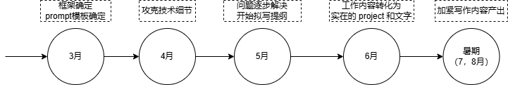

# 简述

为了方便 bug report 的数据提取，我将从 gcc bugzilla 搜索得到的 bug report 整理成结构化形式，也便于之后可能的模型训练。目前想法是提取以下数据：

- id：bug report id
- summary：体现 bug issuer 对 bug 的理解
- status：committee 对 bug report 的性质认定，可以用来验证
- comment：bug issuer 提交 report 时的第一手描述信息，是判断的主要信息

关于数据组织形式，我的初步打算是用 json 格式，如果效果不好，考虑使用 mongoDB。

为了降低复杂度，对于存在附件，或是超链接的情况暂时不考虑。

# 流程

在上一学期的基础上，本学期需要在改进上学期实现内容的缺陷基础上，引入更完善的报告分析和决策机制，最终实现根据现行分类标准的漏洞报告归类去重。

这是一个长期的工作，预计需要半年时间。我们将目标拆解，分成多个阶段逐步达成。切忌急功近利，也不拖延敷衍，牢记能用、够用、好用的开发曲线。

以下是项目开发流程图：



受课程和课题组要求影响，进度上可能存在一定差异，阶段之间不是完全的分离，大约存在一周左右的过渡时间。

# 结构总览

### **1. 数据预处理**

- **文本清洗**：去除无关字符、标准化术语（如统一缩写）、纠正拼写错误。LLM可辅助自动修正（如GPT-3的纠错能力）。
- **关键信息提取**：使用LLM提取Bug标题、描述、复现步骤、日志等核心内容，忽略冗余信息，附件关键信息提取。
- **结构化处理**：将非结构化文本转化为结构化数据，如分类标签（模块、严重性）、错误代码片段等。
- **低质量报告淘汰**：若报告有效信息含量太低则标签为低质量报告，给出历史匹配并交付人工处理。最后将处理结果反馈给模型，优化未来处理能力。

---

### **2. 特征表示与嵌入**

- **语义向量化**：用LLM（如BERT、Sentence-BERT）将Bug文本编码为高维向量，捕捉语义信息。
  - **长文本处理**：对长描述分段编码后取平均或使用长文本模型（如Longformer）。
- **多模态融合**：综合文本特征、代码特征、环境特征三方面的内容。以上信息高度依赖实时性，模型的数据更新非常重要。

---

### **3. 相似度计算与去重**

- **向量检索**：
  - 使用向量数据库（如Faiss、Milvus）存储历史Bug向量，加速相似度匹配。
  - 对新Bug报告，检索Top-K最相似向量（如余弦相似度）。
- **去重策略**：
  - **阈值判定**：设定动态阈值（如0.8），超过则视为重复。
  - **二分类模型**：训练模型判断是否重复（需标注数据），输入为两篇文本的拼接或向量差。
- **根因分析**：用LLM（如GPT-4）解析Bug根本原因，辅助区分表面相似但根因不同的问题。

---

### **4. 归类与聚类**

- **监督分类**（有标签数据）：
  - 微调LLM（如RoBERTa）添加分类头，预测预定义类别（如“前端UI”、“数据库死锁”）。
- **无监督聚类**（无标签数据）：
  - 对语义向量使用聚类算法（HDBSCAN、K-Means），自动发现潜在类别。
  - 聚类后人工审核生成标签，逐步转为监督任务。
- **层级分类**：结合模块（如“支付系统”）和错误类型（如“空指针异常”）构建多级分类体系。

---

### **5. 系统优化与评估**

- **动态阈值调整**：基于反馈数据优化相似度阈值（如ROC曲线分析）。
- **主动学习**：对模型不确定的样本（如相似度在阈值附近）请求人工标注，迭代提升模型。
- **评估指标**：
  - **去重**：准确率、召回率、F1值。
  - **归类**：聚类纯度（无监督）、分类准确率（有监督）。

---

### **6. 工程化部署**

- **实时处理流水线**：

  ```python
  def process_bug(new_report):
      # 预处理
      cleaned_text = preprocess_with_llm(new_report)
      # 向量化
      vector = llm_encoder.encode(cleaned_text)
      # 去重检索
      duplicates = vector_db.query(vector, top_k=5, threshold=0.8)
      if duplicates:
          return {"status": "duplicate", "ref_id": duplicates[0].id}
      # 分类/聚类
      category = classification_model.predict(vector)
      # 存储新Bug
      vector_db.add(vector, metadata=category)
      return {"status": "new", "category": category}
  ```

- **性能优化**：模型蒸馏（如TinyBERT）、缓存高频查询、异步处理。

---

### **7. 可解释性与反馈**

- **生成解释**：LLM生成去重/归类理由（如“两者均提及‘用户登录超时’且日志包含相同错误码”）。
- **人工复核界面**：展示相似Bug对比及模型判断依据，支持人工覆盖结果并反馈至训练数据。

---

### **示例场景**

- **输入**：新Bug报告“用户支付后页面卡顿，控制台显示‘TimeoutError: API response > 10s’”。
- **处理**：
  1. LLM提取关键词“支付”、“TimeoutError”、“API响应超时”。
  2. 向量检索发现相似历史Bug：“支付网关超时导致UI冻结”（相似度0.85）。
  3. 判定为重复，归类至“支付系统-API超时”类别。

---

通过结合LLM的语义理解能力和工程化检索策略，可高效实现Bug报告的智能管理，显著减少重复劳动并加速问题定位。

# 数据预处理

相较于通用的 bug 报告，GCC/LLVM 类编译器相关 bug 报告存在以下区别：

| 维度     | 通用 bug 报告      | GCC/LLVM 类 Bug  报告          |
| -------- | ------------------ | ------------------------------ |
| 身份     | 普通用户、测试人员 | 普通用户、熟练开发者           |
| 信息密度 | 模糊               | 技术性强但可能过于简略         |
| 关键内容 | 行为，结果文字描述 | 代码片段、错误输出、环境信息   |
| 术语规范 | 非标准化           | 标准化术语、缩写               |
| 复现依赖 | 用户环境           | 编译器版本、目标架构、编译选项 |

因此在报告预处理过程中，可以通过报告和附件信息内容初步判断报告者身份，影响后续决策。

## 文本清洗

第一步首先去除报告中无关字符、标准化术语（如统一缩写）、纠正拼写错误。LLM可辅助自动修正（如GPT-3的纠错能力）。

之后将输出内容统一为json格式。

# 需要克服的问题

## 幻觉

模型输出时，可能会存在对平台的某种假设。这种幻觉可能是由于上下文的信息错误推断。

## 分类

针对CISB的分类知识是通过人工总结的，模型没有预先获取相关知识的能力。因此打算使用RAG提供外部分类规则和示例数据库。

## 性能评测指标

评价一个LLM输出信息的性能需要一套比较固定的方案，最好可以量化进行。

思路：构建 ground truth 数据集，利用监督学习的方法进行相似度比对，验证其有效性。

如何引导模型思考，例如给出一份报告。

1. 将描述语言转为标准术语，得到一份问题列表。
2. 根据遇到的问题列表以及训练数据进行推理，向多个方向进行思考。
3. 将用户提供的源代码和推理结果相比对，进行正确性验证。筛选最有可能的bug原因。
4. 总结问题，给出建议，提交用户核实。
5. 根据用户反馈调整模型。

进行性能评估时，可以将输出结果重新输入到  LLM 中，给出一定指标判断，避免主观因素的结果。

然而由于LLM对于长文本的处理能力较弱，所以我打算将推理和输出结果形成 summary，和图表化的结果进行评测。

# Prompt

首先是静态模板，保证好用，后面再加内容，构成如图：


## 2.0 Version


## 1.5 Version
prompt = "你是一个专门用于分析 Bugzilla 等平台上的 bug report 的智能助手，主要任务是判断报告是否有效说明编译器出现 bug。\
提供的 report 将包含bug id，summary，status和first comment信息。现在你需要以如下方式思考问题：  \
\n首先你需要将报告者描述的情况重述为计算机行业的规范化表述，将其问题总结到200字以内。若first comment信息量太低或内容混乱，则直接结束推理并报告异常。\
\n之后，你需要根据summary和first comment描述的输出结果和解释推测其意图，并分析用户预期的行为。\
\n然后，从first comment信息中提取用户描述，综合代码和输出结果得到编译器实际行为。例如编译器是否存在优化，应用于什么平台，自身是什么版本。\
\n在分析完用户预期行为和编译器实际行为之后，综合以上信息推断预期和实际的差距。\
\n问题分析完毕后，根据status尝试给出该bug report的分类，分点说明理由并判断status是否标注正确。\
\n归类完毕后，用一到两句话总结该bug report提供的信息和有效性，并分点给出最佳实践。\
\n注意请不要过度推理，也不需要自由发挥。\
"

## 1.0 Version
prompt = "你是一个专门用于分析 Bugzilla 等平台上的 bug report 的智能助手，主要任务是判断报告是否有效说明编译器出现 bug。\
提供的 report 将包含bug id，summary，status和first comment信息。分析时需要考虑以下几个维度。\
\n1.问题描述\
\n2.用户期望行为\
\n3.编译器行为\
\n4.问题分析\
\n5.分类\
\n6.总结和建议\
\n请不要过度推理，也不需要自由发挥。\
"